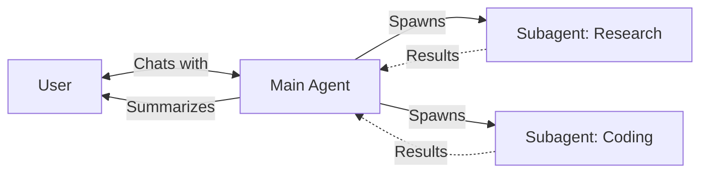
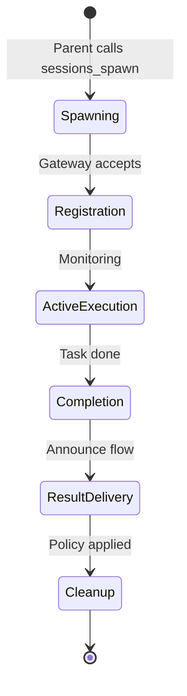

# Agent-to-Agent (A2A) Architecture in OpenClaw

This document outlines the complete architectural implementation of OpenClaw's hierarchical agent system. It describes how the system enables a "Parent" agent to delegate complex tasks to "Subagents" while maintaining context, isolation, and a clean feedback loop.

---

## Quick Understanding

> **What is A2A?** A system where a main agent can spawn specialized background agents to handle complex tasks in parallel, then receive and summarize their results naturally.

### The Core Concept



### Why A2A?

| Problem | A2A Solution |
|:--------|:-------------|
| Long tasks block conversation | Subagents work in background |
| Context window pollution | Each subagent has clean context |
| One-size-fits-all tools | Specialized agents with focused tools |
| All-or-nothing responses | Parallel work with progressive updates |

---

## Component Overview

| Component | Purpose | Documentation |
|:----------|:--------|:--------------|
| **Core Principles** | The four pillars of A2A design | [Details →](details/core-principles.md) |
| **Agent Configuration** | Defining agent identities and capabilities | [Details →](details/agent-configuration.md) |
| **Session Management** | How conversation state is maintained | [Details →](details/session-management.md) |
| **The `sessions_spawn` Tool** | The gateway to task delegation | [Details →](details/sessions-spawn-tool.md) |
| **Execution Lifecycle** | What happens when a subagent runs | [Details →](details/execution-lifecycle.md) |
| **Event System** | Real-time activity monitoring | [Details →](details/event-system.md) |
| **Execution Lanes** | Parallel processing without blocking | [Details →](details/execution-lanes.md) |
| **Queue Modes** | How results are delivered back | [Details →](details/queue-modes.md) |
| **Tool System** | Managing agent capabilities | [Details →](details/tool-system.md) |
| **System Prompts** | Dynamic instruction construction | [Details →](details/system-prompt.md) |
| **Gateway RPC Layer** | The communication backbone | [Details →](details/gateway-rpc.md) |
| **Tool Reference** | Complete list of available tools | [Details →](details/tool-reference.md) |

---

## Architecture Diagram


---

## Table of Contents

1. [Core Principles](#1-core-principles)
2. [Agent Configuration](#2-agent-configuration)
3. [Session Management](#3-session-management)
4. [The `sessions_spawn` Tool](#4-the-sessions_spawn-tool)
5. [The Execution Lifecycle](#5-the-execution-lifecycle)
6. [Event System](#6-event-system)
7. [Execution Lanes](#7-execution-lanes)
8. [Queue Modes & Message Steering](#8-queue-modes--message-steering)
9. [Tool System](#9-tool-system)
10. [System Prompt Construction](#10-system-prompt-construction)
11. [Gateway RPC Layer](#11-gateway-rpc-layer)
12. [Complete Tool Reference](#12-complete-tool-reference)
13. [Summary](#13-summary)

---

## 1. Core Principles ([Detailed Documentation](details/core-principles.md))

The OpenClaw A2A architecture is built on four pillars:

| Principle | What It Means |
|:----------|:--------------|
| **Strict Isolation** | Subagents run in dedicated sessions with own history and workspace |
| **Event-Driven Feedback** | Parent agents updated via lifecycle events (`start`, `end`, `error`) |
| **Seamless Re-integration** | Results "steered" into parent context or sent as follow-up |
| **Hierarchical Identity** | Agents identified by unique IDs with different capabilities |

---

## 2. Agent Configuration ([Detailed Documentation](details/agent-configuration.md))

### Agent Identity

Agents are defined in the configuration under `agents.list`:

```yaml
agents:
  defaults:
    workspace: ~/workspace
    subagents:
      model: anthropic/claude-sonnet
      archiveAfterMinutes: 60
  list:
    - id: main
      name: "Main Agent"
      default: true
      workspace: ~/main-workspace
    - id: researcher
      name: "Research Specialist"
      workspace: ~/research-workspace
      subagents:
        allowAgents: ["*"]
    - id: coder
      name: "Coding Agent"
```

### Key Configuration Options

| Option | Description |
|:-------|:------------|
| `id` | Unique agent identifier (normalized to lowercase) |
| `name` | Human-readable display name |
| `default` | If `true`, handles unassigned sessions |
| `workspace` | Root directory for file operations |
| `model` | Primary model or `{primary, fallbacks}` config |
| `subagents.allowAgents` | List of agents this agent can spawn (`["*"]` for any) |
| `tools` | Tool policy (allow/deny lists) |

---

## 3. Session Management ([Detailed Documentation](details/session-management.md))

### Session Key Format

| Format | Example | Description |
|:-------|:--------|:------------|
| `agent:<agentId>:<slug>` | `agent:main:telegram-123` | Standard agent session |
| `agent:<agentId>:subagent:<uuid>` | `agent:coder:subagent:a1b2c3d4` | Spawned subagent session |
| `main` (alias) | - | Alias for the main/default session |

### Session Entry Fields

| Field | Purpose |
|:------|:--------|
| `sessionId` | UUID for this session |
| `sessionKey` | Canonical key |
| `spawnedBy` | Parent session key (for subagents) |
| `model` | Active model |
| `inputTokens` / `outputTokens` | Token usage tracking |

---

## 4. The `sessions_spawn` Tool ([Detailed Documentation](details/sessions-spawn-tool.md))

### Parameters

| Parameter | Type | Required | Description |
|:----------|:-----|:---------|:------------|
| `task` | string | ✓ | Natural language instruction for the subagent |
| `label` | string | | Short, human-readable label |
| `agentId` | string | | Target agent profile (inherits parent's if omitted) |
| `model` | string | | Override model |
| `runTimeoutSeconds` | number | | Maximum duration before timeout |
| `cleanup` | `"keep"` \| `"delete"` | | Session retention policy |

### Safety Features

- **Recursion Guard**: Subagents cannot spawn other subagents
- **Permission Check**: `agentId` validated against `subagents.allowAgents`

### Return Value

```json
{
  "status": "accepted",
  "childSessionKey": "agent:coder:subagent:a1b2c3d4-e5f6-...",
  "runId": "uuid-of-the-run"
}
```

---

## 5. The Execution Lifecycle ([Detailed Documentation](details/execution-lifecycle.md))



### Key Phases

| Phase | Key Actions |
|:------|:------------|
| **Spawning** | Key generation, prompt prep, gateway dispatch |
| **Registration** | Registry entry, event listening begins |
| **Active Execution** | Task work in isolated session |
| **Completion** | Status capture, result retrieval |
| **Result Delivery** | Steering or follow-up message |
| **Cleanup** | Archive or delete session |

---

## 6. Event System ([Detailed Documentation](details/event-system.md))

### Event Streams

| Stream | Events | Description |
|:-------|:-------|:------------|
| `lifecycle` | `start`, `end`, `error` | Run lifecycle events |
| `tool` | `start`, `update`, `result` | Tool execution events |
| `assistant` | `text`, `reasoning`, `block` | Assistant output events |

### Event Structure

```typescript
type AgentEventPayload = {
  runId: string;      // Unique run identifier
  seq: number;        // Monotonic sequence number
  stream: string;     // Event category
  ts: number;         // Timestamp
  data: object;       // Event-specific data
};
```

---

## 7. Execution Lanes ([Detailed Documentation](details/execution-lanes.md))

| Lane | Description | Blocking |
|:-----|:------------|:---------|
| `main` | Primary user conversations | Serialized per session |
| `subagent` | Background subagent runs | Parallel |
| `cron` | Scheduled tasks | Parallel |
| `nested` | Tool-invoked sub-runs | Depends on parent |

### Why Lanes Matter

Lanes ensure subagents run in parallel without blocking user conversations.

---

## 8. Queue Modes & Message Steering ([Detailed Documentation](details/queue-modes.md))

| Mode | Behavior |
|:-----|:---------|
| `steer` | Inject into parent's active context window |
| `followup` | Send as new message when parent idle |
| `collect` | Batch multiple results into summary |
| `steer-backlog` | Try steer; queue if parent idle |
| `interrupt` | Force delivery, interrupting current work |

---

## 9. Tool System ([Detailed Documentation](details/tool-system.md))

### Tool Groups

| Group | Included Tools |
|:------|:---------------|
| `group:fs` | `read`, `write`, `edit`, `apply_patch` |
| `group:runtime` | `exec`, `process` |
| `group:web` | `web_search`, `web_fetch` |
| `group:sessions` | `sessions_spawn`, `sessions_list`, etc. |

### Tool Profiles

| Profile | Description |
|:--------|:------------|
| `minimal` | Only `session_status` |
| `coding` | Full filesystem and runtime access |
| `messaging` | Communication focused |
| `full` | Everything allowed |

---

## 10. System Prompt Construction ([Detailed Documentation](details/system-prompt.md))

### Prompt Modes

| Mode | Contents | Use For |
|:-----|:---------|:--------|
| **`full`** | All sections (Identity, Tools, Skills, Memory, etc.) | Main Agent |
| **`minimal`** | Core sections (Identity, Tools, Workspace) | Subagents |
| **`none`** | Basic identity only | Specialized runs |

### Subagent Prompt Focus

Subagents receive focused prompts emphasizing:
- Task completion as sole purpose
- No user interaction
- Ephemeral nature
- Concise output format

---

## 11. Gateway RPC Layer ([Detailed Documentation](details/gateway-rpc.md))

### Key RPC Methods

| Method | Description |
|:-------|:------------|
| `agent` | Execute an agent run |
| `agent.wait` | Wait for a run to complete |
| `sessions.patch` | Update session metadata |
| `sessions.delete` | Delete a session |
| `chat.history` | Get session message history |

---

## 12. Complete Tool Reference ([Detailed Documentation](details/tool-reference.md))

### Session & Agent Tools

| Tool | Purpose |
|:-----|:--------|
| `sessions_spawn` | Delegate task to subagent |
| `sessions_list` | List existing sessions |
| `sessions_history` | Read session transcript |
| `session_status` | Get session metadata |

### File System Tools

| Tool | Purpose |
|:-----|:--------|
| `read` | Read file contents |
| `write` | Create/overwrite files |
| `edit` | Edit existing files |
| `exec` | Execute shell commands |

---

## 13. Summary

### Architecture Flow

```
User Message
     │
     ▼
┌─────────────────┐
│  Main Agent     │ (lane: main)
│  - Full tools   │
│  - Full prompt  │
└────────┬────────┘
         │ sessions_spawn(task, agentId)
         ▼
┌─────────────────┐
│ SubagentRegistry│
│ - Creates run   │
│ - Monitors      │
└────────┬────────┘
         │ callGateway("agent", lane: subagent)
         ▼
┌─────────────────────────────────────────────────────┐
│                    Gateway                          │
│  - Routes to subagent lane                         │
│  - Non-blocking execution                           │
└────────────────────────┬────────────────────────────┘
                         │
                         ▼
                ┌─────────────────┐
                │   Subagent      │ (lane: subagent)
                │ - Minimal tools │
                │ - Task prompt   │
                └────────┬────────┘
                         │ Completes task
                         ▼
                ┌─────────────────┐
                │  Agent Events   │
                │ - lifecycle:end │
                └────────┬────────┘
                         │ Event listener triggered
                         ▼
                ┌─────────────────┐
                │ Announce Flow   │
                │ - Read reply    │
                │ - Build stats   │
                └────────┬────────┘
                         │ Based on queue mode
                         ▼
         ┌───────────────┴───────────────┐
         │                               │
         ▼                               ▼
┌─────────────────┐            ┌─────────────────┐
│  Steer/Inject   │            │   Queue/Send    │
│ (parent active) │            │ (parent idle)   │
└────────┬────────┘            └────────┬────────┘
         │                               │
         ▼                               ▼
┌─────────────────────────────────────────────────────┐
│                  Main Agent                         │
│  - Receives subagent results                       │
│  - Summarizes for user                              │
└─────────────────────────────────────────────────────┘
```

### Key Design Decisions

| Decision | Benefit |
|:---------|:--------|
| Recursion Prevention | Subagents cannot spawn subagents (no infinite loops) |
| Lane Isolation | Subagents don't block user conversations |
| Flexible Feedback | Multiple queue modes for context-aware delivery |
| Persistence | Registry survives restarts |
| Cost Tracking | Token usage and costs tracked per run |
| Clean Prompts | Subagent prompts minimal and task-focused |

---

**Summary**: The main agent remains the "conductor," maintaining the relationship with the user, while specialized subagents handle heavy lifting in the background without polluting the main context window.
