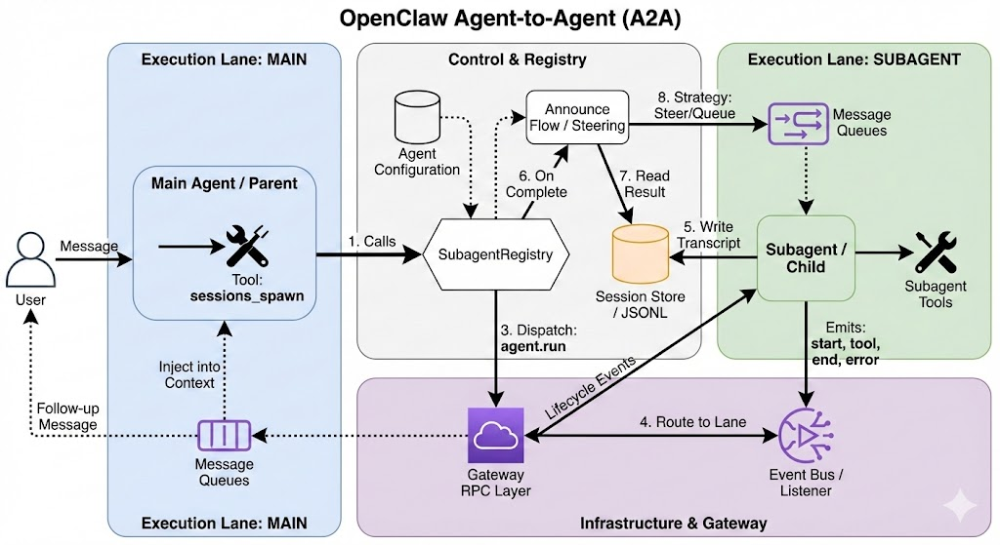

# Agent-to-Agent (A2A) Architecture in OpenClaw

This document outlines the complete architectural implementation of OpenClaw's hierarchical agent system. It describes how the system enables a "Parent" agent to delegate complex tasks to "Subagents" while maintaining context, isolation, and a clean feedback loop.

---

## Table of Contents

1. [Core Principles](#1-core-principles)
2. [Agent Configuration](#2-agent-configuration)
3. [Session Management](#3-session-management)
4. [The `sessions_spawn` Tool](#4-the-sessions_spawn-tool)
5. [The Execution Lifecycle](#5-the-execution-lifecycle)
6. [Event System](#6-event-system)
7. [Execution Lanes](#7-execution-lanes)
8. [Queue Modes & Message Steering](#8-queue-modes--message-steering)
9. [Tool System](#9-tool-system)
10. [System Prompt Construction](#10-system-prompt-construction)
11. [Gateway RPC Layer](#11-gateway-rpc-layer)
12. [Complete Tool Reference](#12-complete-tool-reference)
13. [Summary](#13-summary)

---

## 1. Core Principles

The OpenClaw A2A architecture is built on four pillars:

1. **Strict Isolation**: Subagents run in dedicated sessions with their own history and temporary workspace. Each session key is unique (`agent:<AgentId>:subagent:<UUID>`).

2. **Event-Driven Feedback**: Parent agents are updated via a background registry that monitors subagent lifecycle events (`start`, `end`, `error`).

3. **Seamless Re-integration**: Results from subagents are "steered" back into the parent's thought process naturally using an injection mechanism, or delivered as a follow-up message if the parent is idle.

4. **Hierarchical Agent Identity**: Agents are identified by unique IDs (e.g., `main`, `researcher`, `coder`) and can be configured with different models, tool profiles, and capabilities.



---

## 2. Agent Configuration

### 2.1 Agent Identity

Agents are defined in the configuration under `agents.list`:

```yaml
agents:
  defaults:
    workspace: ~/workspace
    subagents:
      model: anthropic/claude-sonnet
      archiveAfterMinutes: 60
  list:
    - id: main
      name: "Main Agent"
      default: true
      workspace: ~/main-workspace
    - id: researcher
      name: "Research Specialist"
      workspace: ~/research-workspace
      subagents:
        allowAgents: ["*"]  # Can spawn any agent
    - id: coder
      name: "Coding Agent"
```

### 2.2 Key Configuration Options

| Option | Description |
| :--- | :--- |
| `id` | Unique agent identifier (normalized to lowercase) |
| `name` | Human-readable display name |
| `default` | If `true`, this agent handles unassigned sessions |
| `workspace` | Root directory for agent file operations |
| `agentDir` | Directory for agent-specific state/transcripts |
| `model` | Primary model (e.g., `anthropic/claude-sonnet`) or object with `primary` and `fallbacks` |
| `subagents.allowAgents` | List of agent IDs this agent can spawn (`["*"]` for any) |
| `subagents.model` | Default model override for spawned subagents |
| `tools` | Tool policy (allow/deny lists) |
| `sandbox` | Sandbox configuration (Docker, security, etc.) |

### 2.3 Agent Resolution

When resolving which agent handles a request:

1. Parse the session key to extract `agentId` (e.g., `agent:researcher:abc123` → `researcher`)
2. If no agent ID in session key, use `defaultAgentId` (the first agent with `default: true`)
3. Load agent-specific configuration including workspace, model, and tool policies

**Code Reference**: `src/agents/agent-scope.ts`

---

## 3. Session Management

### 3.1 Session Key Format

Session keys uniquely identify each conversation context:

| Format | Example | Description |
| :--- | :--- | :--- |
| `agent:<agentId>:<slug>` | `agent:main:telegram-123` | Standard agent session |
| `agent:<agentId>:subagent:<uuid>` | `agent:coder:subagent:a1b2c3d4` | Spawned subagent session |
| `main` (alias) | - | Alias for the main/default session |
| `global` | - | Global shared context |

### 3.2 Session Entry Structure

Each session maintains:

```typescript
type SessionEntry = {
  sessionId: string;           // UUID for this session
  sessionKey: string;          // Canonical key
  channel?: string;            // telegram, discord, web, etc.
  lastChannel?: string;        // Last active channel
  model?: string;              // Active model
  modelProvider?: string;      // Provider (anthropic, openai, etc.)
  inputTokens?: number;        // Token usage tracking
  outputTokens?: number;
  totalTokens?: number;
  spawnedBy?: string;          // Parent session key (for subagents)
  label?: string;              // Human-readable label
  // ... more fields
};
```

### 3.3 Transcript Persistence

- Session transcripts are stored as JSONL files: `~/.clawdbot/agents/<agentId>/sessions/<sessionId>.jsonl`
- Each line is a JSON object representing a message turn
- The session store (JSON) tracks session metadata separately from transcript content

**Code Reference**: `src/config/sessions.ts`, `src/gateway/session-utils.ts`

---

## 4. The `sessions_spawn` Tool

The primary gateway for A2A interaction is the `sessions_spawn` tool. This tool allows an agent to create a background process to handle a specific task.

### 4.1 Parameters

| Parameter | Type | Required | Description |
| :--- | :--- | :--- | :--- |
| `task` | string | ✓ | Natural language instruction for the subagent |
| `label` | string | | Short, human-readable label (e.g., "research-task") |
| `agentId` | string | | Target agent profile (inherits parent's if omitted) |
| `model` | string | | Override model (e.g., `anthropic/claude-opus`) |
| `thinking` | string | | Override thinking/reasoning level |
| `runTimeoutSeconds` | number | | Maximum duration before timeout |
| `cleanup` | `"keep"` \| `"delete"` | | Session retention policy (default: `keep`) |

### 4.2 Validation & Policy

**Recursion Guard**: The tool explicitly checks if the requester is already a subagent. If so, spawning is rejected (`forbidden`), preventing infinite recursion loops.

```typescript
if (isSubagentSessionKey(requesterSessionKey)) {
  return { status: "forbidden", error: "sessions_spawn is not allowed from sub-agent sessions" };
}
```

**Permission Check**: The `agentId` parameter is validated against the parent's `subagents.allowAgents` configuration:

- `["*"]` → Can spawn any agent
- `["coder", "researcher"]` → Can only spawn these specific agents
- Empty/undefined → Can only spawn self (same agentId)

### 4.3 Return Value

```json
{
  "status": "accepted",
  "childSessionKey": "agent:coder:subagent:a1b2c3d4-e5f6-...",
  "runId": "uuid-of-the-run",
  "modelApplied": true
}
```

**Code Reference**: `src/agents/tools/sessions-spawn-tool.ts`

---

## 5. The Execution Lifecycle

### Step 1: Spawning

When `sessions_spawn` is called:

1. **Session Key Generation**: A unique session key is generated: `agent:<AgentId>:subagent:<UUID>`

2. **System Prompt Injection**: A specialized Subagent System Prompt is built (see Section 10)

3. **Model Configuration**: If specified, the model is patched onto the child session via `sessions.patch`

4. **Gateway Dispatch**: The agent is executed via the gateway's `agent` method:
   ```typescript
   await callGateway({
     method: "agent",
     params: {
       message: task,
       sessionKey: childSessionKey,
       lane: AGENT_LANE_SUBAGENT,  // "subagent"
       extraSystemPrompt: childSystemPrompt,
       spawnedBy: requesterSessionKey,
       // ...
     }
   });
   ```

### Step 2: Registry & Monitoring (SubagentRegistry)

The `SubagentRegistry` is the central nervous system tracking background tasks.

**SubagentRunRecord Structure**:
```typescript
type SubagentRunRecord = {
  runId: string;                    // Unique run identifier
  childSessionKey: string;          // Subagent's session
  requesterSessionKey: string;      // Parent's session
  requesterOrigin?: DeliveryContext; // Reply routing info
  task: string;                     // Original task
  cleanup: "delete" | "keep";       // Retention policy
  label?: string;                   // Human-readable label
  createdAt: number;                // Timestamp
  startedAt?: number;               // When execution began
  endedAt?: number;                 // When execution completed
  outcome?: SubagentRunOutcome;     // ok | error | timeout
  archiveAtMs?: number;             // Scheduled cleanup time
};
```

**Key Functions**:
- `registerSubagentRun()`: Adds run to registry, starts monitoring
- `waitForSubagentCompletion()`: Uses `agent.wait` RPC to wait for completion
- `sweepSubagentRuns()`: Periodically cleans up expired runs
- `persistSubagentRuns()`: Saves registry to disk for restart recovery

**Persistence**: Registry is persisted to disk to survive application restarts. On startup, `restoreSubagentRunsOnce()` resumes monitoring of incomplete runs.

**Code Reference**: `src/agents/subagent-registry.ts`, `src/agents/subagent-registry.store.ts`

### Step 3: Event Listening

The registry listens to global agent events:

```typescript
onAgentEvent((evt) => {
  if (evt.stream !== "lifecycle") return;
  const entry = subagentRuns.get(evt.runId);
  
  if (evt.data.phase === "start") {
    entry.startedAt = evt.data.startedAt;
  }
  if (evt.data.phase === "end" || evt.data.phase === "error") {
    entry.endedAt = evt.data.endedAt;
    entry.outcome = { status: evt.data.phase === "error" ? "error" : "ok" };
    // Trigger announce flow
    runSubagentAnnounceFlow({ ... });
  }
});
```

### Step 4: Completion & Stats

Once the subagent finishes (or times out):

1. **Result Retrieval**: Read the latest assistant reply from the subagent's transcript:
   ```typescript
   const reply = await readLatestAssistantReply({ sessionKey: childSessionKey });
   ```

2. **Stats Compilation**: Usage metrics are gathered:
   - Runtime duration (from `startedAt` to `endedAt`)
   - Token usage (input / output / total)
   - Estimated cost (based on model pricing config)
   - Session IDs and transcript paths

3. **Status Resolution**:
   - `"ok"`: Completed successfully
   - `"error"`: Failed with error message
   - `"timeout"`: Exceeded `runTimeoutSeconds`
   - `"unknown"`: Status could not be determined

### Step 5: Steering & Feedback (Announce Flow)

The `runSubagentAnnounceFlow()` function handles result delivery to the parent:

**Trigger Message Construction**:
```
A background task "${label}" just ${statusLabel}.

Findings:
${reply || "(no output)"}

Stats: runtime 2m34s • tokens 15.2k (in 12.1k / out 3.1k) • est $0.42

Summarize this naturally for the user. Keep it brief (1-2 sentences).
Do not mention technical details like tokens or stats.
You can respond with NO_REPLY if no announcement is needed.
```

**Delivery Modes** (based on queue settings):

| Mode | Behavior |
| :--- | :--- |
| `steer` | **Inject** directly into parent's context window while it's running |
| `followup` | Send as a new message, triggering a new parent run |
| `collect` | Queue messages, deliver as batched summary |
| `steer-backlog` | Try steering; if parent idle, queue for later |
| `interrupt` | Queue then force parent to process |

**Steering Logic**:
```typescript
if (shouldSteer && isEmbeddedPiRunActive(sessionId)) {
  const steered = queueEmbeddedPiMessage(sessionId, triggerMessage);
  if (steered) return "steered";
}
```

**Code Reference**: `src/agents/subagent-announce.ts`, `src/agents/subagent-announce-queue.ts`

### Step 6: Cleanup

- **Archive/Sweep**: Completed runs are kept for `archiveAfterMinutes` (default: 60) before being swept
- **Session Deletion**: If `cleanup: "delete"` was specified:
  ```typescript
  await callGateway({
    method: "sessions.delete",
    params: { key: childSessionKey, deleteTranscript: true }
  });
  ```

---

## 6. Event System

### 6.1 Agent Events

The event system (`src/infra/agent-events.ts`) provides real-time updates on agent activity:

**Event Structure**:
```typescript
type AgentEventPayload = {
  runId: string;           // Unique run identifier
  seq: number;             // Monotonic sequence number per run
  stream: AgentEventStream; // "lifecycle" | "tool" | "assistant" | "error"
  ts: number;              // Timestamp
  data: Record<string, unknown>;
  sessionKey?: string;     // Associated session
};
```

**Event Streams**:

| Stream | Events | Description |
| :--- | :--- | :--- |
| `lifecycle` | `start`, `end`, `error` | Run lifecycle events |
| `tool` | `start`, `update`, `result` | Tool execution events |
| `assistant` | `text`, `reasoning`, `block` | Assistant output events |
| `error` | Error details | Error information |

**Emitting Events**:
```typescript
emitAgentEvent({
  runId: params.runId,
  stream: "tool",
  data: {
    phase: "start",
    name: toolName,
    toolCallId,
    args: { ... }
  }
});
```

**Listening to Events**:
```typescript
const unsubscribe = onAgentEvent((evt) => {
  if (evt.stream === "lifecycle" && evt.data.phase === "end") {
    console.log(`Run ${evt.runId} completed`);
  }
});
// Later: unsubscribe();
```

**Code Reference**: `src/infra/agent-events.ts`

---

## 7. Execution Lanes

Lanes provide isolation and prioritization for different types of agent runs:

### 7.1 Lane Types

```typescript
export const enum CommandLane {
  Main = "main",         // Primary user-facing runs
  Cron = "cron",         // Scheduled/automated runs
  Subagent = "subagent", // Spawned subagent runs
  Nested = "nested",     // Nested tool executions
}
```

### 7.2 Lane Behavior

| Lane | Description | Blocking |
| :--- | :--- | :--- |
| `main` | Primary conversation, user messages | Yes (serialized per session) |
| `cron` | Scheduled tasks, heartbeats | No (parallel) |
| `subagent` | Background subagent runs | No (parallel) |
| `nested` | Tool-invoked sub-runs | Depends on parent |

### 7.3 Lane Resolution

When spawning a subagent:
```typescript
await callGateway({
  method: "agent",
  params: {
    lane: AGENT_LANE_SUBAGENT,  // "subagent"
    // ...
  }
});
```

The gateway routes the run to the appropriate lane, preventing subagent runs from blocking main conversation flow.

**Code Reference**: `src/process/lanes.ts`, `src/agents/lanes.ts`

---

## 8. Queue Modes & Message Steering

### 8.1 Queue Mode Types

```typescript
type QueueMode = "steer" | "followup" | "collect" | "steer-backlog" | "interrupt" | "queue";
```

| Mode | Description |
| :--- | :--- |
| `steer` | Inject message into running agent's context (real-time) |
| `followup` | Queue and send as new message when agent idle |
| `collect` | Batch multiple messages into single summary |
| `steer-backlog` | Try steer; fall back to queue if agent idle |
| `interrupt` | Force delivery, interrupting current work |
| `queue` | Simple FIFO queue |

### 8.2 Queue Settings

```typescript
type QueueSettings = {
  mode: QueueMode;
  debounceMs?: number;   // Wait before draining (default: 1000)
  cap?: number;          // Max queue size (default: 20)
  dropPolicy?: QueueDropPolicy;  // "old" | "new" | "summarize"
};
```

### 8.3 Announce Queue

The announce queue (`src/agents/subagent-announce-queue.ts`) manages subagent result delivery:

```typescript
enqueueAnnounce({
  key: sessionKey,
  item: {
    prompt: triggerMessage,
    summaryLine: taskLabel,
    enqueuedAt: Date.now(),
    sessionKey,
    origin: deliveryContext
  },
  settings: queueSettings,
  send: sendAnnounce
});
```

**Drain Logic**:
1. Wait for debounce period
2. Check if cross-channel delivery needed (handle separately)
3. For `collect` mode: batch all items with summary
4. Send messages in order

**Code Reference**: `src/agents/subagent-announce-queue.ts`, `src/auto-reply/reply/queue/`

---

## 9. Tool System

### 9.1 Tool Profiles

Profiles define which tools are available to an agent:

```typescript
const TOOL_PROFILES = {
  minimal: { allow: ["session_status"] },
  coding: { allow: ["group:fs", "group:runtime", "group:sessions", "group:memory", "image"] },
  messaging: { allow: ["group:messaging", "sessions_list", "sessions_history", "sessions_send", "session_status"] },
  full: {},  // Everything allowed
};
```

### 9.2 Tool Groups

Tools are organized into logical groups:

```typescript
const TOOL_GROUPS = {
  "group:memory": ["memory_search", "memory_get"],
  "group:web": ["web_search", "web_fetch"],
  "group:fs": ["read", "write", "edit", "apply_patch"],
  "group:runtime": ["exec", "process"],
  "group:sessions": ["sessions_list", "sessions_history", "sessions_send", "sessions_spawn", "session_status"],
  "group:ui": ["browser", "canvas"],
  "group:automation": ["cron", "gateway"],
  "group:messaging": ["message"],
  "group:nodes": ["nodes"],
  "group:openclaw": [/* all native tools */],
};
```

### 9.3 Tool Policy Resolution

Tool access is determined by layered policies:

1. **Profile Policy**: Base profile (`coding`, `full`, etc.)
2. **Agent Config**: Per-agent `tools.allow` / `tools.deny`
3. **Sandbox Policy**: Reduced tools when sandboxed
4. **Runtime Context**: Session-specific overrides

```typescript
function resolveToolProfilePolicy(profile?: string): ToolProfilePolicy | undefined {
  const resolved = TOOL_PROFILES[profile];
  return {
    allow: resolved.allow ? expandToolGroups(resolved.allow) : undefined,
    deny: resolved.deny ? [...resolved.deny] : undefined,
  };
}
```

**Code Reference**: `src/agents/tool-policy.ts`

### 9.4 Tool Execution Flow

1. **Tool Call Start**: Agent requests tool execution
2. **Event Emission**: `tool:start` event emitted
3. **Execution**: Tool handler runs asynchronously
4. **Progress Updates**: `tool:update` for long-running tools
5. **Result**: `tool:result` event with output or error
6. **Context Update**: Result added to session for next turn

```typescript
async function handleToolExecutionStart(ctx, evt) {
  // Flush block replies before tool execution
  ctx.flushBlockReplyBuffer();
  
  // Emit event
  emitAgentEvent({
    runId: ctx.params.runId,
    stream: "tool",
    data: { phase: "start", name: toolName, toolCallId, args }
  });
  
  // Track messaging tools for deduplication
  if (isMessagingTool(toolName)) {
    ctx.state.pendingMessagingTargets.set(toolCallId, sendTarget);
  }
}
```

**Code Reference**: `src/agents/pi-embedded-subscribe.handlers.tools.ts`

---

## 10. System Prompt Construction

### 10.1 Main Agent Prompt

The main agent system prompt includes multiple sections:

| Section | Contents |
| :--- | :--- |
| **Identity** | Agent name, personality, owner info |
| **Runtime** | Agent ID, host, OS, model, workspace |
| **Time** | Current timestamp, timezone |
| **Workspace** | Working directory, docs path |
| **Reply Tags** | Format for structured responses |
| **Messaging** | Available channels, delivery hints |
| **Skills** | Loaded skill prompts |
| **Memory** | Memory search instructions |
| **Voice** | TTS hints if enabled |

**Prompt Modes**:
- `full`: All sections (main agent)
- `minimal`: Reduced sections (subagents)
- `none`: Basic identity only

**Code Reference**: `src/agents/system-prompt.ts`

### 10.2 Subagent System Prompt

Subagents receive a specialized prompt emphasizing task focus:

```typescript
function buildSubagentSystemPrompt(params) {
  return `
# Subagent Context

You are a **subagent** spawned by the main agent for a specific task.

## Your Role
- You were created to handle: ${taskText}
- Complete this task. That's your entire purpose.
- You are NOT the main agent. Don't try to be.

## Rules
1. **Stay focused** - Do your assigned task, nothing else
2. **Complete the task** - Your final message will be automatically reported
3. **Don't initiate** - No heartbeats, no proactive actions, no side quests
4. **Be ephemeral** - You may be terminated after task completion. That's fine.

## Output Format
When complete, your final response should include:
- What you accomplished or found
- Any relevant details the main agent should know
- Keep it concise but informative

## What You DON'T Do
- NO user conversations (that's main agent's job)
- NO external messages unless explicitly tasked
- NO cron jobs or persistent state
- NO pretending to be the main agent
- NO using the \`message\` tool directly

## Session Context
- Label: ${label}
- Requester session: ${requesterSessionKey}
- Your session: ${childSessionKey}
`;
}
```

**Code Reference**: `src/agents/subagent-announce.ts`

---

## 11. Gateway RPC Layer

### 11.1 Gateway Architecture

The gateway provides a WebSocket-based RPC layer for agent coordination:

```
┌─────────────────┐     ┌─────────────────┐     ┌─────────────────┐
│   CLI/Client    │────▶│     Gateway     │────▶│   Agent Runner  │
│                 │◀────│   (WebSocket)   │◀────│                 │
└─────────────────┘     └─────────────────┘     └─────────────────┘
```

### 11.2 Key RPC Methods

| Method | Description |
| :--- | :--- |
| `agent` | Execute an agent run |
| `agent.wait` | Wait for a run to complete |
| `agent.identity.get` | Get agent identity info |
| `sessions.list` | List sessions |
| `sessions.patch` | Update session metadata |
| `sessions.delete` | Delete a session |
| `chat.history` | Get session message history |
| `chat.send` | Send a message to a channel |

### 11.3 Calling the Gateway

```typescript
const result = await callGateway({
  method: "agent",
  params: {
    message: task,
    sessionKey: childSessionKey,
    lane: "subagent",
    // ...
  },
  timeoutMs: 10_000
});
```

**Code Reference**: `src/gateway/call.ts`, `src/gateway/server-methods/`

### 11.4 Agent Method Handler

The `agent` method in the gateway:

1. Validates parameters
2. Resolves session and agent configuration
3. Enqueues the command in the appropriate lane
4. Tracks the run for `agent.wait` calls
5. Returns run ID immediately (async)

```typescript
agentHandlers.agent = async ({ params, respond, context }) => {
  // Validation...
  const runId = randomUUID();
  
  // Enqueue the agent command
  enqueueCommandInLane({
    lane: params.lane || CommandLane.Main,
    command: agentCommand,
    params: { ...params, runId },
  });
  
  // Return immediately
  respond(true, { runId, status: "accepted" });
};
```

**Code Reference**: `src/gateway/server-methods/agent.ts`

---

## 12. Complete Tool Reference

### 12.1 Session & Agent Tools

| Tool | Purpose |
| :--- | :--- |
| `sessions_spawn` | Creates and delegates a task to a subagent |
| `agents_list` | Lists available agent IDs that can be spawned |
| `sessions_list` | Lists existing sessions (own or spawned) |
| `sessions_history` | Reads the transcript of a session |
| `sessions_send` | Sends a message to a running session (A2A communication) |
| `session_status` | Gets current session status and metadata |

### 12.2 File System Tools

| Tool | Purpose |
| :--- | :--- |
| `read` | Read file contents |
| `write` | Write/create files |
| `edit` | Edit existing files |
| `apply_patch` | Apply unified diff patches |

### 12.3 Runtime Tools

| Tool | Purpose |
| :--- | :--- |
| `exec` | Execute shell commands |
| `process` | Manage background processes |

### 12.4 Web Tools

| Tool | Purpose |
| :--- | :--- |
| `web_search` | Search the web |
| `web_fetch` | Fetch URL content |
| `browser` | Control browser automation |

### 12.5 Memory Tools

| Tool | Purpose |
| :--- | :--- |
| `memory_search` | Search agent memory |
| `memory_get` | Retrieve memory entries |

### 12.6 Communication Tools

| Tool | Purpose |
| :--- | :--- |
| `message` | Send messages to external channels |
| `gateway` | Gateway management |
| `nodes` | Device/node management |

### 12.7 Other Tools

| Tool | Purpose |
| :--- | :--- |
| `cron` | Manage scheduled tasks |
| `canvas` | Canvas/UI generation |
| `image` | Image generation |
| `tts` | Text-to-speech |

---

## 13. Summary

### Architecture Flow Diagram

```
User Message
     │
     ▼
┌─────────────────┐
│  Main Agent     │ (lane: main)
│  - Full tools   │
│  - Full prompt  │
└────────┬────────┘
         │
         │ sessions_spawn(task, agentId)
         ▼
┌─────────────────┐
│ SubagentRegistry│
│ - Creates run   │
│ - Generates key │
│ - Monitors      │
└────────┬────────┘
         │
         │ callGateway("agent", lane: subagent)
         ▼
┌─────────────────────────────────────────────────────┐
│                    Gateway                          │
│  - Routes to subagent lane                         │
│  - Non-blocking execution                           │
└────────────────────────┬────────────────────────────┘
                         │
                         ▼
                ┌─────────────────┐
                │   Subagent      │ (lane: subagent)
                │ - Minimal tools │
                │ - Task prompt   │
                └────────┬────────┘
                         │
                         │ Completes task
                         ▼
                ┌─────────────────┐
                │  Agent Events   │
                │ - lifecycle:end │
                └────────┬────────┘
                         │
                         │ Event listener triggered
                         ▼
                ┌─────────────────┐
                │ Announce Flow   │
                │ - Read reply    │
                │ - Build stats   │
                │ - Format msg    │
                └────────┬────────┘
                         │
                         │ Based on queue mode
                         ▼
         ┌───────────────┴───────────────┐
         │                               │
         ▼                               ▼
┌─────────────────┐            ┌─────────────────┐
│  Steer/Inject   │            │   Queue/Send    │
│ (parent active) │            │ (parent idle)   │
└────────┬────────┘            └────────┬────────┘
         │                               │
         ▼                               ▼
┌─────────────────────────────────────────────────────┐
│                  Main Agent                         │
│  - Receives subagent results                       │
│  - Summarizes for user                              │
│  - Continues conversation                           │
└─────────────────────────────────────────────────────┘
```

### Key Design Decisions

1. **Recursion Prevention**: Subagents cannot spawn other subagents (enforced via session key detection)

2. **Lane Isolation**: Subagents run in dedicated lanes to avoid blocking user conversations

3. **Flexible Feedback**: Multiple queue modes allow context-aware result delivery

4. **Persistence**: Registry survives restarts to ensure runs are tracked to completion

5. **Cost Tracking**: Token usage and estimated costs are tracked per run for billing/reporting

6. **Clean Prompts**: Subagent prompts are minimal and task-focused to maximize efficiency

This architecture ensures that the main agent remains the "conductor," maintaining the relationship with the user, while specialized subagents handle heavy lifting in the background without polluting the main context window.
