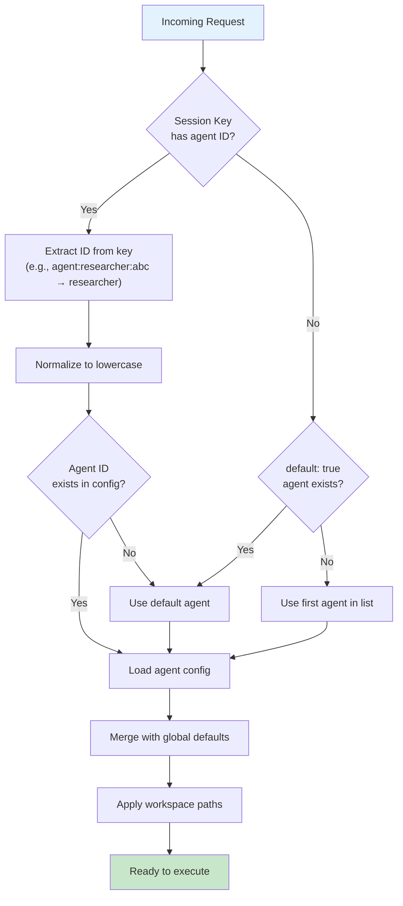
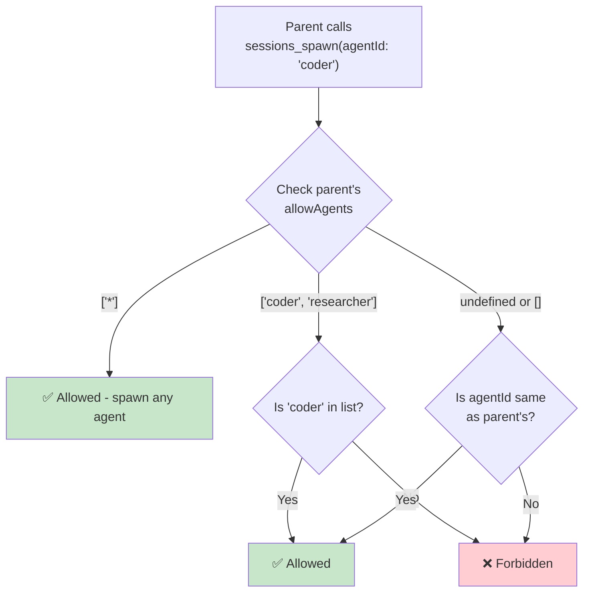

[← Go Back to Main Architecture](../README.md)

# Agent Configuration in OpenClaw

OpenClaw uses a hierarchical configuration system to define agent identities, capabilities, and constraints. This document details how agents are defined, resolved, and used within the system.

---

## Quick Reference

| What You Need | Where to Look |
|:--------------|:--------------|
| Define a new agent | `agents.list` in `config.yaml` |
| Set default agent | Add `default: true` to agent config |
| Control spawning permissions | `subagents.allowAgents` |
| Restrict tools | `tools.allow` / `tools.deny` |

---

## 1. Defining Agents

Agents are defined in the `agents.list` section of the OpenClaw configuration file (usually `config.yaml` or `config.json`).

### Configuration Schema

| Option | Type | Required | Description |
|:-------|:-----|:---------|:------------|
| `id` | `string` | ✓ | Unique identifier (e.g., `main`, `coder`). Auto-normalized to lowercase. |
| `name` | `string` | | Human-readable display name for logs and UI. |
| `default` | `boolean` | | If `true`, handles sessions where no ID is specified. |
| `workspace` | `string` | | Root directory for file operations. Supports `~` expansion. |
| `agentDir` | `string` | | Directory for agent-specific state and transcripts. |
| `model` | `string` or `object` | | Primary model or `{primary, fallbacks}` configuration. |
| `tools` | `object` | | Policy defining allowed/denied tools and profiles. |
| `subagents` | `object` | | Configuration for spawning (e.g., `allowAgents`, `model`). |
| `sandbox` | `object` | | Security and isolation settings (Docker, etc.). |
| `identity` | `object` | | Identity-related prompts (personality, role). |

### Complete Configuration Example

```yaml
agents:
  # Global defaults applied to all agents
  defaults:
    workspace: ~/openclaw-workspace
    subagents:
      model: anthropic/claude-sonnet    # Default model for subagents
      archiveAfterMinutes: 60           # Cleanup completed runs after 1 hour
  
  list:
    # Primary agent - handles direct user conversations
    - id: main
      name: "Guardian"
      default: true                      # ← Handles unassigned sessions
      model: anthropic/claude-3-5-sonnet-latest
      workspace: ~/main-workspace
      subagents:
        allowAgents: ["*"]               # Can spawn any agent
    
    # Specialized research agent
    - id: researcher
      name: "Insight Specialist"
      workspace: ~/research-data
      model: openai/gpt-4o               # Faster model for research
      tools:
        allow: ["group:web", "group:memory"]  # Limited tool access
    
    # Specialized coding agent
    - id: coder
      name: "Code Craftsman"
      model:
        primary: anthropic/claude-3-5-sonnet-latest
        fallbacks:
          - openai/gpt-4o
      tools:
        allow: ["group:fs", "group:runtime", "group:sessions"]
      sandbox:
        enabled: true
        docker:
          image: "openclaw/sandbox:latest"
```

---

## 2. Agent Resolution Logic

When a request comes in, the system must determine which agent should handle it.

### Resolution Flowchart



### Session Key Parsing Examples

| Session Key | Extracted Agent ID | Notes |
|:------------|:-------------------|:------|
| `agent:researcher:abc123` | `researcher` | Standard format |
| `agent:coder:subagent:uuid-here` | `coder` | Subagent session |
| `main` | (default) | Alias - uses default agent |
| `telegram-group-123` | (default) | No agent prefix - uses default |
| `agent:CODER:task-1` | `coder` | Normalized to lowercase |

---

## 3. Directory and Workspace Management

Each agent is assigned specific directories to ensure isolation.

### Directory Structure

```
~/.openclaw/
├── agents/
│   ├── main/
│   │   ├── sessions/
│   │   │   ├── session-uuid-1.jsonl    # Transcript
│   │   │   └── session-uuid-2.jsonl
│   │   └── state/                       # Agent-specific state
│   ├── researcher/
│   │   └── sessions/
│   └── coder/
│       └── sessions/
├── workspace-main/                      # Main agent workspace
├── workspace-researcher/                # Researcher workspace
└── workspace-coder/                     # Coder workspace
```

### Path Resolution

| Config Option | Default Value | Description |
|:--------------|:--------------|:------------|
| `workspace` | `~/.openclaw/workspace-<agentId>` | Where agent reads/writes files |
| `agentDir` | `~/.openclaw/agents/<agentId>` | State, transcripts, history |

> **Tip**: Use separate workspaces when agents need to work on different projects simultaneously without file conflicts.

---

## 4. Subagent Policies

Agents can be restricted in their ability to spawn other agents using the `subagents.allowAgents` setting.

### Permission Levels

| Configuration | Effect |
|:--------------|:-------|
| `allowAgents: ["*"]` | Can spawn any defined agent |
| `allowAgents: ["coder", "researcher"]` | Only spawn these specific agents |
| `allowAgents: []` or not set | Can only spawn using own ID |

### Permission Decision Tree



### Example: Controlled Delegation

```yaml
agents:
  list:
    - id: main
      subagents:
        allowAgents: ["researcher", "coder"]  # Can delegate to specialists
    
    - id: researcher
      # No allowAgents = cannot spawn others
    
    - id: coder
      subagents:
        allowAgents: []  # Explicitly cannot spawn
```

With this configuration:
- `main` can spawn `researcher` or `coder`
- `researcher` cannot spawn any agent (subagents cannot spawn)
- `coder` cannot spawn any agent

---

## 5. Model Configuration

Models can be specified as simple strings or with fallback options.

### Simple Model

```yaml
model: anthropic/claude-sonnet
```

### Model with Fallbacks

```yaml
model:
  primary: anthropic/claude-3-5-sonnet-latest
  fallbacks:
    - openai/gpt-4o
    - anthropic/claude-sonnet
```

When the primary model is unavailable or rate-limited, the system automatically tries fallbacks in order.

---

## 6. Common Configuration Patterns

### Pattern: Research-First Workflow

```yaml
agents:
  list:
    - id: main
      model: anthropic/claude-sonnet
      subagents:
        allowAgents: ["researcher"]
        model: openai/gpt-4o-mini  # Use faster model for research
    
    - id: researcher
      tools:
        allow: ["group:web"]  # Only web access
```

### Pattern: Sandboxed Code Execution

```yaml
agents:
  list:
    - id: main
      subagents:
        allowAgents: ["coder"]
    
    - id: coder
      sandbox:
        enabled: true
        docker:
          image: "openclaw/sandbox:latest"
          networkAccess: false  # No external network
      tools:
        allow: ["group:fs", "group:runtime"]
        deny: ["message"]  # Cannot send messages
```

---

## Code Reference

The agent configuration and resolution logic is implemented in:
- `src/agents/agent-scope.ts` - `resolveSessionAgentId` and `resolveAgentConfig`
