[← Go Back to Main Architecture](../README.md)

# Core Principles of OpenClaw's A2A Architecture

OpenClaw's Agent-to-Agent (A2A) architecture is designed to handle complex, multi-step tasks by delegating them to specialized subagents. This approach ensures that the main agent remains responsive and focused, while background tasks are handled in an isolated environment.

---

## Quick Summary

| Principle | What It Means | Why It Matters |
|:----------|:--------------|:---------------|
| **Strict Isolation** | Each subagent runs in its own session | Prevents context pollution between tasks |
| **Event-Driven Feedback** | Parent is notified via lifecycle events | Non-blocking, real-time monitoring |
| **Seamless Re-integration** | Results injected naturally into parent context | Smooth user experience |
| **Hierarchical Identity** | Agents have distinct profiles and capabilities | Right tool for the right job |

---

## The Four Pillars

The architecture is built on four fundamental pillars that work together to enable reliable task delegation:

```mermaid
graph TB
    subgraph "OpenClaw A2A Foundation"
        direction TB
        
        ISO[🔒 Strict Isolation]
        EVT[📡 Event-Driven Feedback]
        INT[🔄 Seamless Re-integration]
        HIE[👤 Hierarchical Identity]
        
        ISO --> |"Enables safe"| EVT
        EVT --> |"Triggers"| INT
        HIE --> |"Configures"| ISO
        INT --> |"Returns to"| HIE
    end
    
    style ISO fill:#e1f5fe
    style EVT fill:#fff3e0
    style INT fill:#e8f5e9
    style HIE fill:#fce4ec
```



---

## 1. Strict Isolation

Each subagent operates within its own dedicated session, which provides complete separation from the parent and other subagents.

### What Gets Isolated

| Aspect | Isolation Method | Benefit |
|:-------|:-----------------|:--------|
| **History** | Subagents don't inherit parent's conversation | Prevents context pollution |
| **Workspace** | Separate directories per agent | No file operation conflicts |
| **Session Key** | Unique format: `agent:<id>:subagent:<uuid>` | Easy tracking and management |
| **Memory** | Independent memory/context window | Focused attention on task |

### Example: Session Key Structure

```
Parent Session:    agent:main:telegram-123
                        ↓
                  spawns subagent
                        ↓
Child Session:     agent:coder:subagent:a1b2c3d4-e5f6-7890-abcd-ef1234567890
                   └─agent─┘ └─type──┘ └────────────UUID────────────────┘
```

> **Key Point**: Subagents start with a clean slate. They only know what the parent explicitly tells them in the `task` parameter.

---

## 2. Event-Driven Feedback

The parent agent is kept informed of the subagent's progress through a background registration system that operates without blocking.

### Event Flow


### Lifecycle Events

| Event | When Fired | Contains |
|:------|:-----------|:---------|
| `lifecycle:start` | Subagent begins execution | `runId`, `startedAt`, `sessionKey` |
| `lifecycle:end` | Task completed successfully | `runId`, `endedAt`, `outcome: "ok"` |
| `lifecycle:error` | Task failed | `runId`, `endedAt`, `outcome: "error"`, `errorMessage` |

> **Key Point**: The parent can continue interacting with the user while monitoring happens automatically in the background.

---

## 3. Seamless Re-integration

Results from subagents are delivered back to the parent agent in a way that feels natural to the conversation flow.

### Delivery Methods

| Method | When Used | How It Works |
|:-------|:----------|:-------------|
| **Steering** | Parent is currently active | Inject directly into parent's context window |
| **Follow-up** | Parent is idle | Send as new message, triggering parent run |
| **Collect** | Multiple subagents finishing | Batch into single summary message |

### The Announce Flow


### What Gets Delivered

The parent receives a structured trigger message containing:

1. **Status**: Which task finished and whether it succeeded
2. **Findings**: The subagent's final output/response
3. **Stats**: Runtime duration, token usage, estimated cost
4. **Instructions**: How to summarize for the user

> **Key Point**: The system generates a natural language summary automatically - users don't see raw technical details.

---

## 4. Hierarchical Agent Identity

The system supports specialized agents, each with its own identity, tools, and capabilities.

### Agent Specialization Example

| Agent ID | Specialty | Typical Tools | Model Choice |
|:---------|:----------|:--------------|:-------------|
| `main` | User interaction | All tools | Balanced model |
| `researcher` | Information gathering | `web_search`, `web_fetch` | Fast model |
| `coder` | Code development | `read`, `write`, `exec` | Powerful model |

### Identity Configuration

```yaml
agents:
  list:
    - id: main
      name: "Primary Assistant"
      default: true
      model: anthropic/claude-sonnet
      
    - id: researcher
      name: "Research Specialist"
      tools:
        allow: ["group:web"]
      subagents:
        allowAgents: ["*"]  # Can spawn any agent
```

### Spawning Permissions

```mermaid
graph TD
    A[Main Agent] -->|"Can spawn"| B[Researcher]
    A -->|"Can spawn"| C[Coder]
    A -->|"Can spawn"| D[Writer]
    
    B -.->|"❌ Cannot spawn"| X[Any Agent]
    C -.->|"❌ Cannot spawn"| X
    D -.->|"❌ Cannot spawn"| X
    
    style X fill:#ffcdd2
```



> **Key Point**: Only the main (parent) agent can spawn subagents. Subagents cannot spawn other subagents, preventing infinite recursion.

---

## Design Rationale: Why This Approach?

By breaking down complex tasks into smaller, isolated sub-tasks, OpenClaw achieves:

| Benefit | How It's Achieved |
|:--------|:------------------|
| **Reduced Hallucination** | Specialized agents with limited context focus on specific tasks |
| **Scalability** | Multiple subagents run in parallel, speeding up workflows |
| **Maintainability** | Clear boundaries make debugging and improvements easier |
| **User Experience** | Organized, responsive system with clear progress updates |

---

## How It All Connects


**Summary**: The parent agent remains the "conductor," maintaining the relationship with the user, while specialized subagents handle heavy lifting in the background without polluting the main context window.
