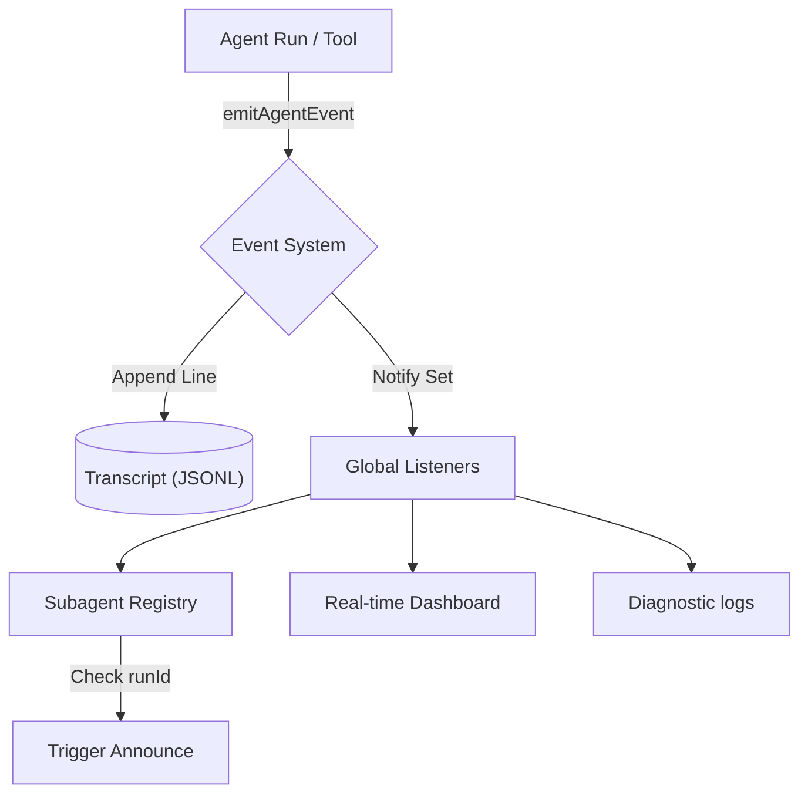

[← Go Back to Main Architecture](../README.md)

# The Agent Event System

The Event System is the central nervous system of OpenClaw, providing real-time visibility into agent activities for monitoring, logging, and coordination. It uses a monotonic sequence and timestamped payloads to ensure all actions are tracked accurately.

## 1. Event Structure

Every event in the system follows a standard `AgentEventPayload` structure:

```typescript
type AgentEventPayload = {
  runId: string;           // Unique identifier for the agent execution run
  seq: number;             // Monotonic sequence number per run
  stream: AgentEventStream; // The type of event (see below)
  ts: number;              // Timestamp in milliseconds
  data: Record<string, unknown>; // Event-specific data
  sessionKey?: string;     // Associated session (optional)
};
```

## 2. Event Streams

Events are categorized into different streams based on their purpose:

| Stream | Events | Description |
| :--- | :--- | :--- |
| `lifecycle` | `start`, `end`, `error` | Tracks the beginning and end of an agent run, including final outcomes. |
| `tool` | `start`, `update`, `result` | Detailed tracking of tool execution, arguments, and return values. |
| `assistant` | `text`, `reasoning`, `block` | Real-time streaming of model output (text and internal reasoning). |
| `error` | - | Specific error events occurring during a run. |



## 3. Emitting and Listening

The system provides a simple interface for emitting and subscribing to events.

### 3.1 Emitting Events
Agents and tools emit events using `emitAgentEvent`. The system automatically manages the sequence number (`seq`) and timestamp (`ts`).

```typescript
emitAgentEvent({
  runId: "run-123",
  stream: "tool",
  data: {
    phase: "start",
    name: "read",
    args: { path: "hello.txt" }
  }
});
```

### 3.2 Listening for Events
Any part of the system can subscribe to events using `onAgentEvent`.

```typescript
const unsubscribe = onAgentEvent((evt) => {
  if (evt.stream === "lifecycle" && evt.data.phase === "end") {
    console.log(`Run ${evt.runId} completed successfully.`);
  }
});

// To stop listening:
unsubscribe();
```

## 4. Run Context

The system can associate a `runId` with a specific context (like a `sessionKey`) using `registerAgentRunContext`. This metadata is automatically fetched and added to every event emitted for that `runId`, eliminating the need to pass it manually every time.

## 5. Persistence

Every event emitted is logged as a line in a JSONL (JSON Lines) file associated with the session. This transcript serves as the permanent record of the interaction and is used for history management and debugging.

**Code Reference**: `src/infra/agent-events.ts`.
