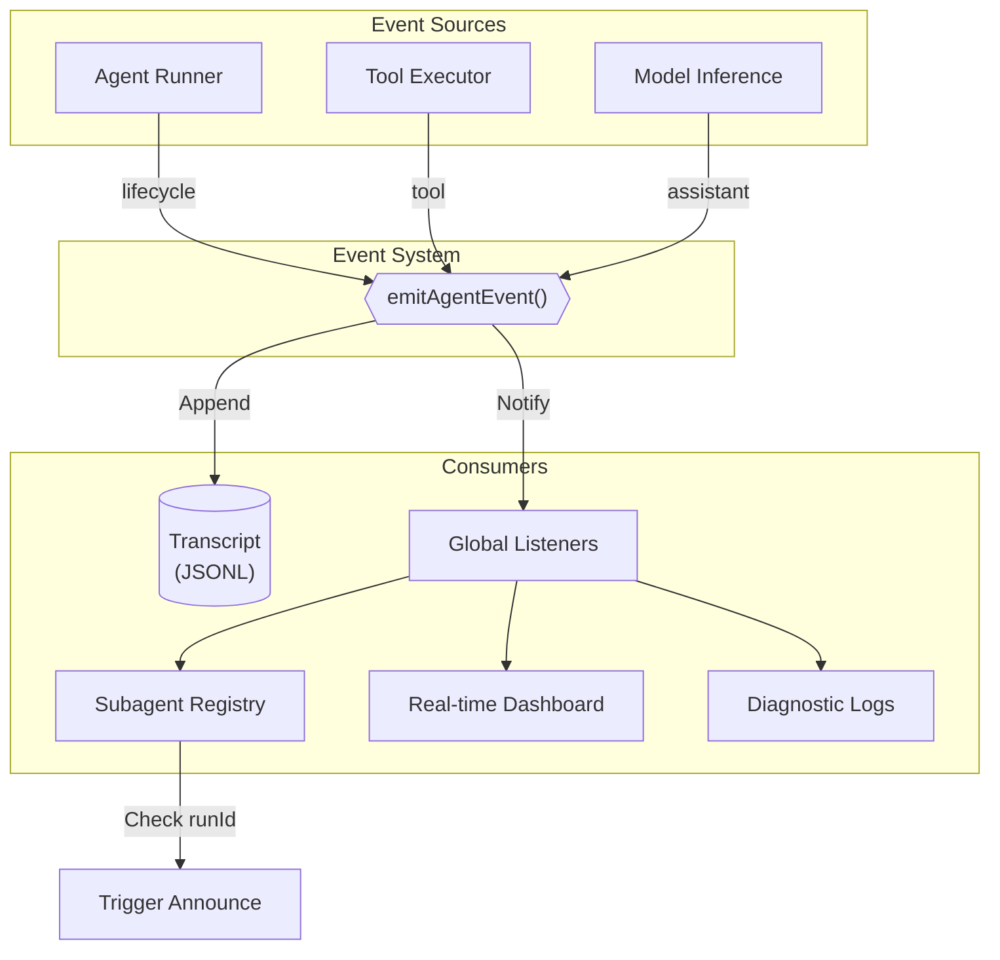
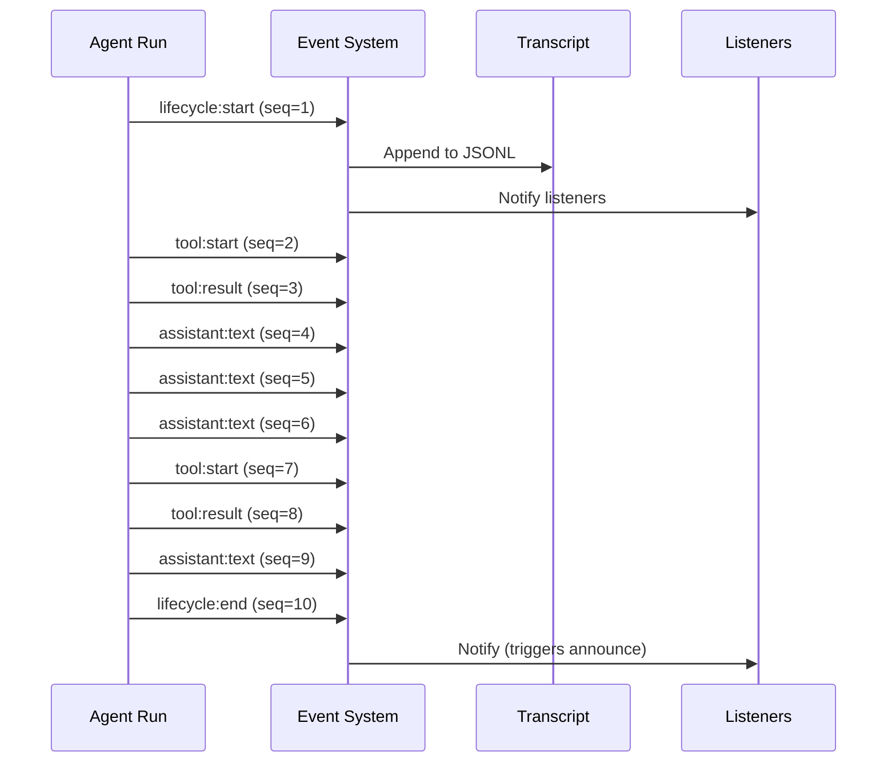

[← Go Back to Main Architecture](../README.md)

# The Agent Event System

The Event System is the central nervous system of OpenClaw, providing real-time visibility into agent activities for monitoring, logging, and coordination. It uses a monotonic sequence and timestamped payloads to ensure all actions are tracked accurately.

---

## Quick Reference

| Concept | Description |
|:--------|:------------|
| **Event** | A timestamped record of agent activity |
| **Stream** | Category of event (lifecycle, tool, assistant, error) |
| **RunId** | Unique identifier linking events to a specific execution |
| **Seq** | Monotonic sequence number within a run |

---

## 1. Event Structure

Every event in the system follows a standard `AgentEventPayload` structure:

```typescript
type AgentEventPayload = {
  runId: string;            // Unique identifier for the agent run
  seq: number;              // Monotonic sequence number (1, 2, 3...)
  stream: AgentEventStream; // Event category
  ts: number;               // Timestamp in milliseconds
  data: Record<string, unknown>; // Event-specific payload
  sessionKey?: string;      // Associated session (optional)
};
```

---

## 2. Event Streams

Events are categorized into different streams based on their purpose:

| Stream | Phase Events | Description | Example Use |
|:-------|:-------------|:------------|:------------|
| `lifecycle` | `start`, `end`, `error` | Run lifecycle events | Subagent monitoring |
| `tool` | `start`, `update`, `result` | Tool execution tracking | Debugging, progress |
| `assistant` | `text`, `reasoning`, `block` | Model output streaming | Real-time display |
| `error` | - | Error details | Alerting, logging |

### Stream Flow Diagram



---

## 3. Event Examples

### Lifecycle Events

**Run Start**
```json
{
  "runId": "abc-123",
  "seq": 1,
  "stream": "lifecycle",
  "ts": 1706621234567,
  "data": {
    "phase": "start",
    "sessionKey": "agent:coder:subagent:xyz",
    "model": "anthropic/claude-sonnet"
  }
}
```

**Run End**
```json
{
  "runId": "abc-123",
  "seq": 15,
  "stream": "lifecycle",
  "ts": 1706621250000,
  "data": {
    "phase": "end",
    "outcome": "ok",
    "inputTokens": 1200,
    "outputTokens": 350
  }
}
```

### Tool Events

**Tool Start**
```json
{
  "runId": "abc-123",
  "seq": 5,
  "stream": "tool",
  "ts": 1706621238000,
  "data": {
    "phase": "start",
    "name": "web_search",
    "toolCallId": "call_1",
    "args": { "query": "OpenClaw documentation" }
  }
}
```

**Tool Result**
```json
{
  "runId": "abc-123",
  "seq": 6,
  "stream": "tool",
  "ts": 1706621240000,
  "data": {
    "phase": "result",
    "name": "web_search",
    "toolCallId": "call_1",
    "result": "Found 5 results..."
  }
}
```

### Assistant Events

**Text Streaming**
```json
{
  "runId": "abc-123",
  "seq": 10,
  "stream": "assistant",
  "ts": 1706621245000,
  "data": {
    "phase": "text",
    "delta": "The latest Node.js LTS version is",
    "accumulated": "The latest Node.js LTS version is"
  }
}
```

---

## 4. Event Timeline

A typical agent run produces events in this sequence:



---

## 5. Emitting and Listening

### Emitting Events

Agents and tools emit events using `emitAgentEvent`. The system automatically manages the sequence number and timestamp.

```typescript
emitAgentEvent({
  runId: "abc-123",
  stream: "tool",
  data: {
    phase: "start",
    name: "read",
    args: { path: "hello.txt" }
  }
});
// seq and ts are auto-populated
```

### Listening for Events

Any part of the system can subscribe to events using `onAgentEvent`:

```typescript
const unsubscribe = onAgentEvent((evt) => {
  // Filter by stream
  if (evt.stream === "lifecycle") {
    if (evt.data.phase === "start") {
      console.log(`Run ${evt.runId} started`);
    }
    if (evt.data.phase === "end") {
      console.log(`Run ${evt.runId} completed`);
    }
  }
  
  // Filter by runId
  if (evt.runId === targetRunId && evt.stream === "tool") {
    console.log(`Tool ${evt.data.name}: ${evt.data.phase}`);
  }
});

// Stop listening when done
unsubscribe();
```

---

## 6. Run Context

The system can associate a `runId` with metadata using `registerAgentRunContext`:

```typescript
registerAgentRunContext(runId, {
  sessionKey: "agent:main:user-123",
  agentId: "main"
});

// Now all events for this runId automatically include sessionKey
```

This eliminates the need to pass `sessionKey` with every event emission.

---

## 7. Persistence

Every event is appended to the session's transcript file:

| Aspect | Details |
|:-------|:--------|
| **Location** | `~/.clawdbot/agents/<agentId>/sessions/<sessionId>.jsonl` |
| **Format** | One JSON object per line |
| **Benefits** | Streaming writes, easy replay, debugging |

### Transcript Example

```jsonl
{"runId":"abc-123","seq":1,"stream":"lifecycle","ts":1706621234567,"data":{"phase":"start"}}
{"runId":"abc-123","seq":2,"stream":"tool","ts":1706621235000,"data":{"phase":"start","name":"web_search"}}
{"runId":"abc-123","seq":3,"stream":"tool","ts":1706621237000,"data":{"phase":"result","name":"web_search"}}
{"runId":"abc-123","seq":4,"stream":"assistant","ts":1706621238000,"data":{"phase":"text","delta":"Hello"}}
```

---

## 8. Common Patterns

### Waiting for Run Completion

```typescript
const waitForRun = (targetRunId: string): Promise<void> => {
  return new Promise((resolve) => {
    const unsubscribe = onAgentEvent((evt) => {
      if (evt.runId === targetRunId && 
          evt.stream === "lifecycle" && 
          (evt.data.phase === "end" || evt.data.phase === "error")) {
        unsubscribe();
        resolve();
      }
    });
  });
};
```

### Monitoring Tool Progress

```typescript
onAgentEvent((evt) => {
  if (evt.stream === "tool" && evt.data.phase === "update") {
    updateProgressBar(evt.data.progress);
  }
});
```

---

## Code Reference

- **Event System**: `src/infra/agent-events.ts`
