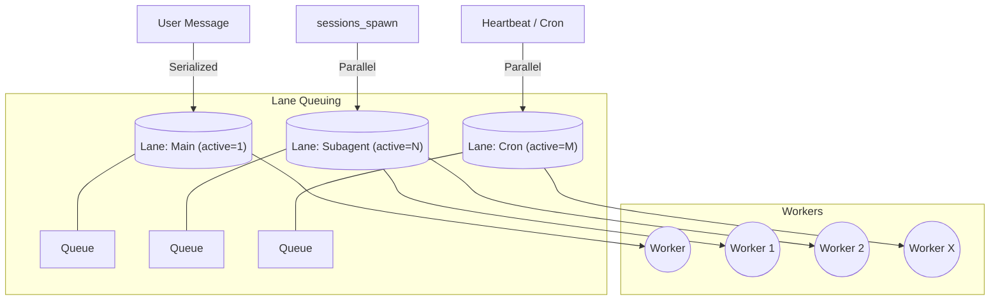

[← Go Back to Main Architecture](../README.md)

# Execution Lanes in OpenClaw

Execution Lanes provide isolation, prioritization, and resource management for different types of agent activities. By separating tasks into different lanes, OpenClaw ensures that background processes (like subagents or cron jobs) do not block or interfere with primary user conversations.

## 1. Lane Types

The system defines four primary lanes in the `CommandLane` enum:

| Lane | ID | Primary Use Case |
| :--- | :--- | :--- |
| **Main** | `main` | Primary user-facing interactions and messages. |
| **Cron** | `cron` | Scheduled tasks and recurring heartbeats. |
| **Subagent** | `subagent` | Background tasks spawned via `sessions_spawn`. |
| **Nested** | `nested` | Tool-invoked agent runs (nested agent execution). |

## 2. Resource Management & Concurrency

Each lane has a `maxConcurrent` setting that limits how many tasks in that lane can run simultaneously.

-   **Main Lane**: Concurrency is typically set per session or globally via `agents.maxConcurrentRuns`. Usually, commands within the same session are serialized to maintain conversation order.
-   **Subagent Lane**: Designed for parallel execution. The system can handle multiple subagents at once, with the limit defined by `agents.defaults.subagents.maxConcurrentRuns`.
-   **Cron Lane**: Concurrency is controlled by `cron.maxConcurrentRuns`.

## 3. How Lanes Work

Lanes are managed by a centralized `command-queue` system.

1.  **Enqueuing**: When an agent run is requested (via fixed CLI command, Gateway RPC, or tool), it is assigned to a specific lane.
2.  **Queueing**: If the number of active runs in that lane has reached `maxConcurrent`, the new task is placed in a FIFO (First-In-First-Out) queue.
3.  **Draining**: As soon as an active task finishes, the queue "pumps," and the next task in the lane is started.
4.  **Logging**: Every enqueue and dequeue event is logged, allowing for performance monitoring and detection of "bottlenecked" lanes.

## 4. Lane Resolution in A2A

In the Agent-to-Agent architecture, lanes play a critical role:
-   When `sessions_spawn` is called, it explicitly requests the `subagent` lane.
-   This ensures the subagent starts immediately (if capacity allows) without waiting for the parent agent to finish its current turn.
-   The parent and subagent can effectively "think" at the same time, with the system handling the complexity of parallel execution and result merging.

**Code References**:
- `src/process/lanes.ts`: Defines the `CommandLane` enum.
- `src/process/command-queue.ts`: Implements the queuing and pump logic.
- `src/gateway/server-lanes.ts`: Applies concurrency limits from the configuration to each lane.
