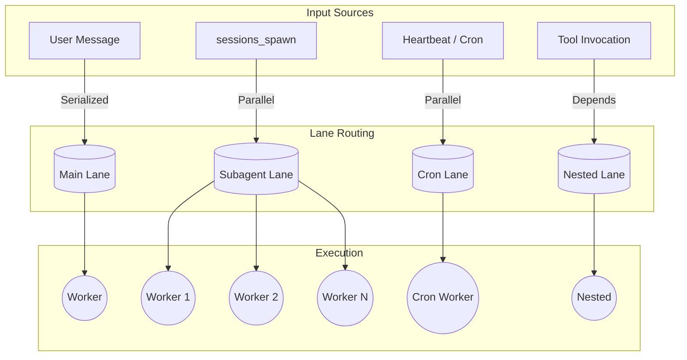
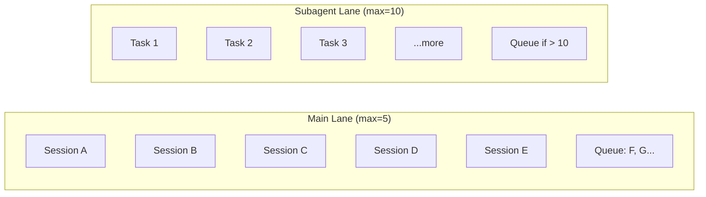
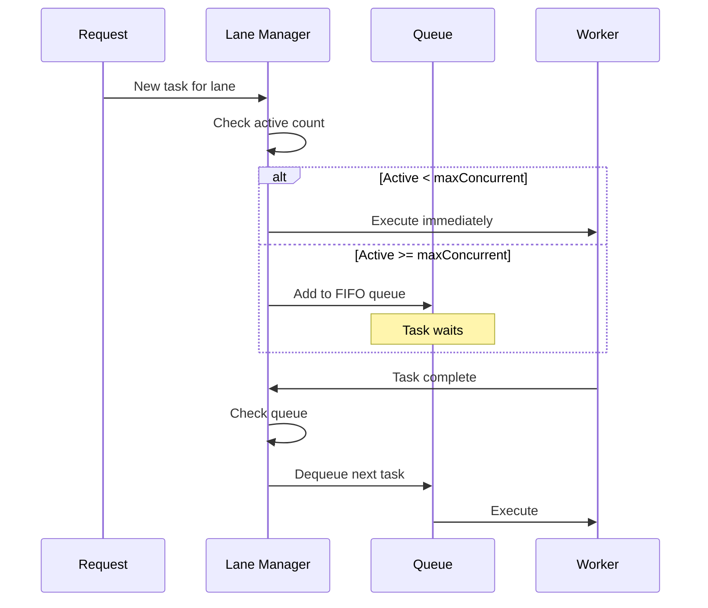
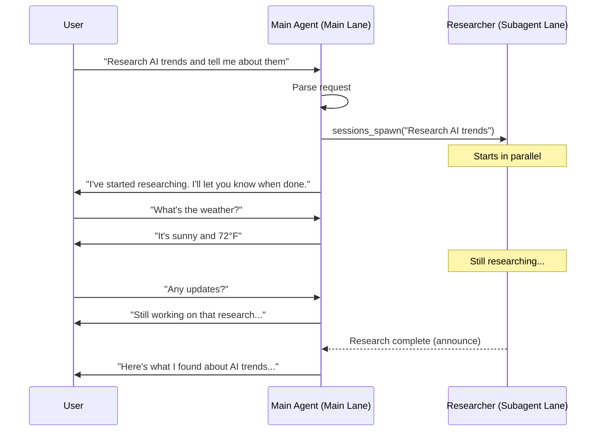

[← Go Back to Main Architecture](../README.md)

# Execution Lanes in OpenClaw

Execution Lanes provide isolation, prioritization, and resource management for different types of agent activities. By separating tasks into different lanes, OpenClaw ensures that background processes (like subagents or cron jobs) do not block or interfere with primary user conversations.

---

## Quick Reference

| Lane | Primary Use | Blocking | Concurrency |
|:-----|:------------|:---------|:------------|
| `main` | User conversations | Serialized | Per-session |
| `subagent` | Background tasks | Parallel | Configurable |
| `cron` | Scheduled tasks | Parallel | Configurable |
| `nested` | Tool sub-runs | Inherits | From parent |

---

## 1. Lane Architecture



---

## 2. Lane Types

### Main Lane

| Aspect | Details |
|:-------|:--------|
| **Purpose** | Primary user-facing interactions |
| **Behavior** | Commands serialized per session |
| **Use Case** | Chat conversations, direct commands |
| **Concurrency** | Usually 1 per session |

```
User: "Hello"     → Main Lane → [Queue] → Execute → Response
User: "Help me"   → Main Lane → [Queue] → (waits) → Execute → Response
```

### Subagent Lane

| Aspect | Details |
|:-------|:--------|
| **Purpose** | Background tasks from `sessions_spawn` |
| **Behavior** | Parallel execution |
| **Use Case** | Research, code analysis, long-running tasks |
| **Concurrency** | Configurable via `maxConcurrentRuns` |

```
Parent: spawn("Research A")  → Subagent Lane → Execute immediately
Parent: spawn("Research B")  → Subagent Lane → Execute immediately
Parent: spawn("Research C")  → Subagent Lane → Execute immediately
(All three run in parallel)
```

### Cron Lane

| Aspect | Details |
|:-------|:--------|
| **Purpose** | Scheduled and recurring tasks |
| **Behavior** | Parallel, fire-and-forget |
| **Use Case** | Heartbeats, reminders, periodic checks |
| **Concurrency** | Configurable via `cron.maxConcurrentRuns` |

### Nested Lane

| Aspect | Details |
|:-------|:--------|
| **Purpose** | Tool-invoked sub-runs |
| **Behavior** | Inherits from parent lane |
| **Use Case** | Complex tools that need agent capabilities |
| **Concurrency** | Bound by parent |

---

## 3. Concurrency Configuration

Each lane has configurable concurrency limits:

```yaml
agents:
  maxConcurrentRuns: 5           # Main lane global limit
  defaults:
    subagents:
      maxConcurrentRuns: 10      # Subagent lane limit

cron:
  maxConcurrentRuns: 3           # Cron lane limit
```

### Capacity Planning



---

## 4. Queue Behavior

### How Lanes Queue Tasks



### Queue Properties

| Property | Behavior |
|:---------|:---------|
| **Order** | FIFO (First-In-First-Out) |
| **Fairness** | Per-session serialization in main lane |
| **Monitoring** | Enqueue/dequeue events logged |
| **Bottleneck Detection** | Alerting when queue grows |

---

## 5. Why Separate Lanes?

### The Problem Lanes Solve

Without lanes, a long-running subagent could block user conversations:

```
❌ WITHOUT LANES (Bad):
User: "Hello"           → Queued behind...
Subagent: (10 min task) → Currently executing
User waits 10 minutes to get "Hello" response
```

With lanes, user conversations are never blocked:

```
✅ WITH LANES (Good):
Main Lane:     User: "Hello" → Execute immediately → "Hi!"
Subagent Lane: (10 min task) → Runs in parallel
User gets immediate response, subagent works in background
```

### Visual Comparison

```mermaid
gantt
    title Execution With Lanes
    dateFormat X
    axisFormat %s
    
    section Main Lane
    User Chat        :active, m1, 0, 2
    User Question    :active, m2, 3, 2
    User Follow-up   :active, m3, 6, 2
    
    section Subagent Lane
    Research Task    :active, s1, 1, 8
    Code Analysis    :active, s2, 2, 6
```



Both lanes execute concurrently - user never waits for subagents.

---

## 6. Lane Resolution in A2A

When `sessions_spawn` is called, the system explicitly requests the `subagent` lane:

```typescript
await callGateway({
  method: "agent",
  params: {
    message: task,
    sessionKey: childSessionKey,
    lane: "subagent",  // ← Explicit lane selection
    // ...
  }
});
```

This ensures:
- Subagent starts immediately (if capacity allows)
- No waiting for parent's current turn to complete
- Parent and subagent can "think" simultaneously

---

## 7. Example Scenarios

### Scenario: Research During Chat



### Scenario: Parallel Research

```mermaid
gantt
    title Three Subagents in Parallel
    dateFormat X
    axisFormat %s
    
    section Main Lane
    User request     :done, m1, 0, 1
    Spawns 3 tasks   :done, m2, 1, 1
    Continues chat   :active, m3, 2, 8
    
    section Subagent Lane
    Research Task A  :active, s1, 2, 4
    Research Task B  :active, s2, 2, 5
    Research Task C  :active, s3, 2, 3
```



All three research tasks run simultaneously while the main agent remains responsive.

---

## Code References

- **Lane Definitions**: `src/process/lanes.ts` (`CommandLane` enum)
- **Queue Logic**: `src/process/command-queue.ts`
- **Gateway Lane Config**: `src/gateway/server-lanes.ts`
