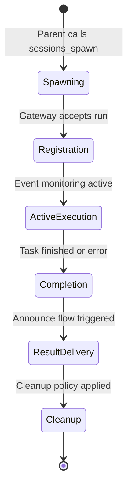
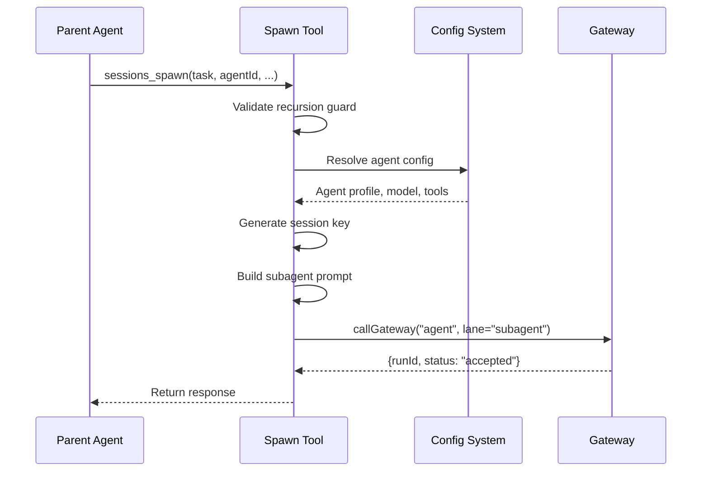
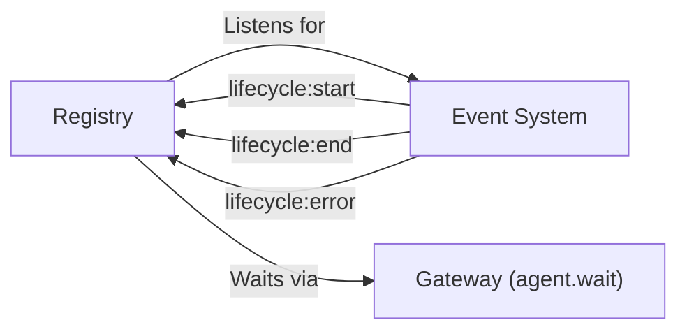
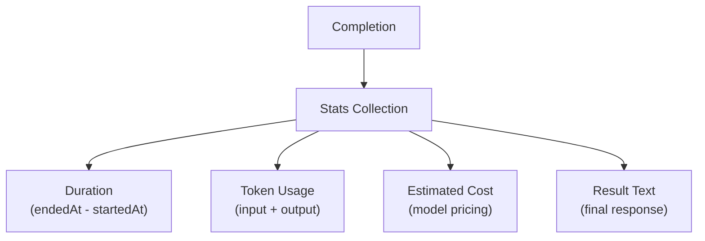
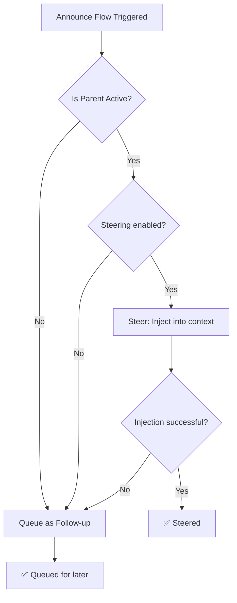
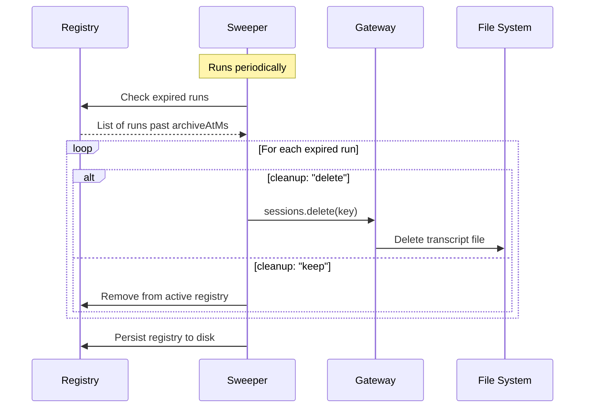

[← Go Back to Main Architecture](../README.md)

# The Subagent Execution Lifecycle

The execution lifecycle of a subagent in OpenClaw is a highly orchestrated process that ensures tasks are carried out reliably, results are reported accurately, and resources are managed efficiently. This document walks through each phase of this lifecycle.

---

## Lifecycle Overview



---

## Phase Summary

| Phase | Duration | Key Actions | State Changes |
|:------|:---------|:------------|:--------------|
| **Spawning** | ~100ms | Key generation, prompt prep, dispatch | `runId` created |
| **Registration** | ~50ms | Registry entry, event listening | `SubagentRunRecord` saved |
| **Active Execution** | Variable | Task work, tool usage | Events emitted |
| **Completion** | ~100ms | Status capture, result retrieval | `outcome` set |
| **Result Delivery** | ~200ms | Message construction, steering/followup | Parent notified |
| **Cleanup** | Delayed | Archive or delete session | Resources freed |

---

## Phase 1: Spawning (The Creation)

Everything begins when a parent agent calls the `sessions_spawn` tool.



### Key Actions

| Action | Details |
|:-------|:--------|
| **Identity Resolution** | Determine which agent profile and model to use |
| **Session Initialization** | Create unique key: `agent:<id>:subagent:<uuid>` |
| **System Prompt Prep** | Build specialized subagent prompt emphasizing task focus |
| **Gateway Dispatch** | Send to Gateway via `agent` method in `subagent` lane |

---

## Phase 2: Registration & Monitoring

As soon as the task is accepted, it is recorded in the `SubagentRegistry`.

### SubagentRunRecord

```typescript
{
  runId: "uuid",                    // Unique run identifier
  childSessionKey: "agent:...",     // Subagent's session
  requesterSessionKey: "agent:...", // Parent's session
  task: "Original task text",       // For reference
  cleanup: "keep" | "delete",       // Retention policy
  label: "Task Name",               // Human-readable
  createdAt: 1706621234567,         // Timestamp
  startedAt: null,                  // Set when execution begins
  endedAt: null,                    // Set when completed
  outcome: null                     // Set to ok|error|timeout
}
```

### Monitoring Setup



---

## Phase 3: Active Execution

The subagent runs in its isolated environment, completely independent of the parent.

### Isolation Properties

| Aspect | Behavior |
|:-------|:---------|
| **Context** | Only sees its own transcript and task instructions |
| **Tools** | Uses tools allowed by its agent profile |
| **History** | No access to parent's conversation history |
| **Events** | Emits `tool:start`, `assistant:text` for monitoring |

### Event Timeline Example

```mermaid
gantt
    title Subagent Execution Timeline
    dateFormat X
    axisFormat %s
    
    section Lifecycle
    Start Event           :milestone, m1, 0, 0
    End Event            :milestone, m2, 10, 0
    
    section Tool Calls
    web_search           :active, t1, 1, 3
    read (file)          :active, t2, 4, 2
    
    section Output
    Thinking             :o1, 6, 2
    Final Response       :o2, 8, 2
```



---

## Phase 4: Completion & Outcome

When the subagent finishes its task, the system captures the final state.

### Outcome Types

| Status | Meaning | Cause |
|:-------|:--------|:------|
| `ok` | Completed successfully | Normal completion |
| `error` | Failed with error | Exception, tool failure |
| `timeout` | Exceeded time limit | `runTimeoutSeconds` reached |
| `unknown` | Status undetermined | Rare edge case |

### Stats Collection

Upon completion, the system gathers:



---

## Phase 5: Result Delivery (The Announce Flow)

The `runSubagentAnnounceFlow` function handles result delivery to the parent.

### Trigger Message Format

```
A background task "${label}" just ${statusLabel}.

Findings:
${reply || "(no output)"}

Stats: runtime 2m34s • tokens 15.2k (in 12.1k / out 3.1k) • est $0.42

Summarize this naturally for the user. Keep it brief (1-2 sentences).
Do not mention technical details like tokens or stats.
You can respond with NO_REPLY if no announcement is needed.
```

### Delivery Decision



---

## Phase 6: Post-Processing & Cleanup

### Retention Policy

| `cleanup` Value | Behavior |
|:----------------|:---------|
| `keep` | Session archived after `archiveAfterMinutes` |
| `delete` | Session and transcript deleted immediately |

### Cleanup Process



### Persistence for Recovery

The registry is saved to disk to survive application restarts:

- **On shutdown**: Registry persisted to JSON file
- **On startup**: `restoreSubagentRunsOnce()` resumes monitoring incomplete runs

---

## Troubleshooting

| Symptom | Likely Cause | Solution |
|:--------|:-------------|:---------|
| Subagent never completes | Infinite loop in task | Set `runTimeoutSeconds` |
| Results not delivered | Parent session closed | Check parent session state |
| High token usage | Overly broad task | Be more specific in task |
| Cleanup not happening | Sweeper not running | Check process health |

---

## Code References

- **Registry Logic**: `src/agents/subagent-registry.ts`
- **Announce Flow**: `src/agents/subagent-announce.ts`
- **Registry Persistence**: `src/agents/subagent-registry.store.ts`
