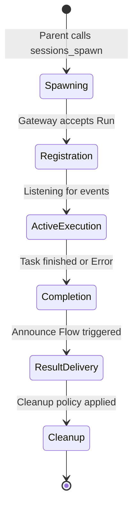

[← Go Back to Main Architecture](../README.md)

# The Subagent Execution Lifecycle

The execution lifecycle of a subagent in OpenClaw is a highly orchestrated process that ensures tasks are carried out reliably, results are reported accurately, and resources are managed efficiently. This document walks through each phase of this lifecycle.

## Phase 1: Spawning (The Creation)

Everything begins when a parent agent calls the `sessions_spawn` tool.
-   **Identity Resolution**: The system determines which agent profile and model to use.
-   **Session Initialization**: A unique session key is created (`agent:<id>:subagent:<uuid>`).
-   **System Prompt Prep**: A specialized subagent system prompt is injected into the session metadata.
-   **Gateway Dispatch**: The task is sent to the Gateway via the `agent` method in the `subagent` lane.

## Phase 2: Registration & Monitoring

As soon as the task is accepted, it is recorded in the `SubagentRegistry`.
-   **Run Record**: A `SubagentRunRecord` is created, tracking the original task, parent session, and expected behavior (timeouts, cleanup policy).
-   **Event Listening**: The registry starts listening for global agent events. It specifically watches for `lifecycle` events (`start`, `end`, `error`) associated with the subagent's `runId`.
-   **Gateway Wait**: The system proactively calls `agent.wait` (a non-blocking Gateway RPC) to be notified as soon as the run finishes.

## Phase 3: Active Execution

The subagent runs in its isolated environment.
-   **Context Isolation**: It only has access to its own transcript and the specific instructions provided in the `task`.
-   **Tool Usage**: It can use any tools allowed by its agent profile (e.g., searching the web, reading files).
-   **Interim Updates**: While running, it emits `tool:start` and `assistant:text` events, which can be monitored for real-time dashboards or debugging.

## Phase 4: Completion & Outcome

When the subagent finishing its task:
-   **Status Capture**: The system captures the final status (`ok`, `error`, or `timeout`).
-   **Result Retrieval**: The latest assistant reply is read from the subagent's transcript. This represents the "findings" of the subagent.
-   **Usage Statistics**: The system calculates the runtime duration, total input/output tokens, and estimated cost based on the model's pricing profile.

## Phase 5: Result Delivery (The Announce Flow)

The `runSubagentAnnounceFlow` is triggered to deliver the results back to the parent.
-   **Trigger Message**: A structured message is built for the parent agent, containing the findings and stats.
-   **Steering**: If the parent is currently active, the system attempts to "steer" (inject) this information directly into the parent's current thought process.
-   **Follow-up**: If the parent is idle, the system sends a follow-up message, triggering the parent to process the new information.
-   **Natural Language Generation**: The parent agent receives the trigger message and generates a natural, conversational update for the user (unless it's an internal task).

## Phase 6: Post-Processing & Cleanup

-   **Session Retention**: Depending on the `cleanup` parameter, the session is either marked for archival or immediately deleted.
-   **Registry Sweeping**: A background "sweeper" periodically removes expired runs from the registry and deletes associated files to free up disk space.
-   **Persistence**: The entire registry is saved to disk, ensuring that even if OpenClaw restarts, pending subagent tasks and results are not lost.

**Code References**:
- `src/agents/subagent-registry.ts`: Logic for tracking and monitoring runs.
- `src/agents/subagent-announce.ts`: Logic for result delivery and stats calculation.
