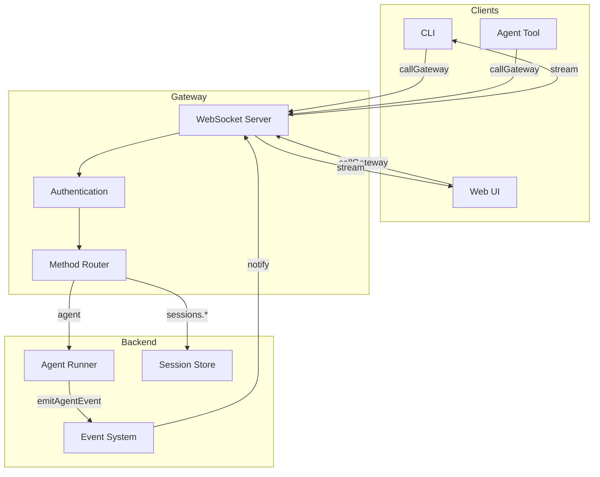
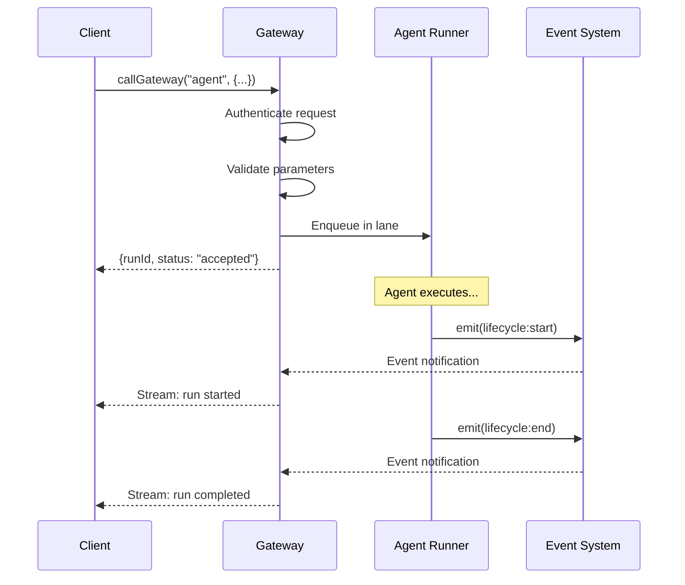
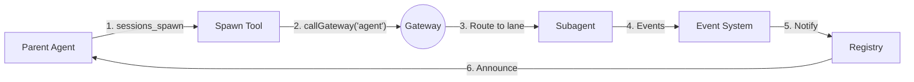

[← Go Back to Main Architecture](../README.md)

# The Gateway RPC Layer

The OpenClaw Gateway is a communication hub that enables different components of the system (CLI, agents, tools, and remote clients) to interact with each other. It uses a WebSocket-based RPC (Remote Procedure Call) layer for real-time, asynchronous communication.

---

## Quick Reference

| Concept | Description |
|:--------|:------------|
| **Gateway** | Central WebSocket server for all RPC calls |
| **callGateway** | Client helper for making RPC calls |
| **RPC Method** | Named function that can be called remotely |
| **Lane Routing** | Gateway routes runs to appropriate execution lanes |

---

## 1. Architecture Overview



### Transport & Protocol

| Aspect | Details |
|:-------|:--------|
| **Transport** | WebSockets (WS/WSS) |
| **Protocol** | JSON-RPC inspired format |
| **Authentication** | Token, Password, TLS fingerprint |
| **Features** | Persistent connections, bi-directional streaming |

---

## 2. Key RPC Methods

### Method Summary

| Method | Purpose | Returns |
|:-------|:--------|:--------|
| `agent` | Start an agent run | `runId` (async) |
| `agent.wait` | Wait for run completion | Status + timestamps |
| `agent.identity.get` | Get agent identity info | Agent metadata |
| `sessions.list` | List sessions | Session entries |
| `sessions.patch` | Update session metadata | Updated entry |
| `sessions.delete` | Delete a session | Confirmation |
| `chat.history` | Get message history | Transcript |
| `chat.send` | Send to channel | Delivery status |

---

### 2.1 `agent` Method

Executes an agent run asynchronously.

**Request:**
```json
{
  "method": "agent",
  "params": {
    "message": "Research the latest AI trends",
    "sessionKey": "agent:researcher:subagent:abc123",
    "lane": "subagent",
    "extraSystemPrompt": "Focus on research only",
    "spawnedBy": "agent:main:user-456"
  }
}
```

**Response:**
```json
{
  "success": true,
  "result": {
    "runId": "run-uuid-here",
    "status": "accepted"
  }
}
```

| Parameter | Required | Description |
|:----------|:---------|:------------|
| `message` | ✓ | The task/message for the agent |
| `sessionKey` | ✓ | Target session |
| `lane` | | Execution lane (`main`, `subagent`, `cron`) |
| `extraSystemPrompt` | | Additional system context |
| `spawnedBy` | | Parent session (for subagents) |

---

### 2.2 `agent.wait` Method

Blocks until a specific run completes (with timeout).

**Request:**
```json
{
  "method": "agent.wait",
  "params": {
    "runId": "run-uuid-here",
    "timeoutMs": 60000
  }
}
```

**Response:**
```json
{
  "success": true,
  "result": {
    "status": "ok",
    "startedAt": 1706621234567,
    "endedAt": 1706621250000
  }
}
```

| Status | Meaning |
|:-------|:--------|
| `ok` | Run completed successfully |
| `error` | Run failed with error |
| `timeout` | Wait timeout exceeded |

---

### 2.3 `sessions.patch` Method

Updates session metadata.

**Request:**
```json
{
  "method": "sessions.patch",
  "params": {
    "key": "agent:coder:subagent:xyz",
    "patch": {
      "model": "anthropic/claude-sonnet",
      "label": "Code Review Task"
    }
  }
}
```

**Response:**
```json
{
  "success": true,
  "result": {
    "sessionKey": "agent:coder:subagent:xyz",
    "model": "anthropic/claude-sonnet",
    "label": "Code Review Task"
  }
}
```

---

### 2.4 `sessions.delete` Method

Deletes a session and optionally its transcript.

**Request:**
```json
{
  "method": "sessions.delete",
  "params": {
    "key": "agent:coder:subagent:xyz",
    "deleteTranscript": true
  }
}
```

**Response:**
```json
{
  "success": true,
  "result": {
    "deleted": true
  }
}
```

---

### 2.5 `chat.history` Method

Retrieves conversation history for a session.

**Request:**
```json
{
  "method": "chat.history",
  "params": {
    "sessionKey": "agent:main:user-123",
    "limit": 50,
    "before": 1706621250000
  }
}
```

**Response:**
```json
{
  "success": true,
  "result": {
    "messages": [
      { "role": "user", "content": "Hello!", "ts": 1706621234567 },
      { "role": "assistant", "content": "Hi there!", "ts": 1706621235000 }
    ],
    "hasMore": true
  }
}
```

---

## 3. The `callGateway` Helper

OpenClaw provides a client helper that abstracts connection complexity:

```typescript
const result = await callGateway({
  method: "agent",
  params: {
    message: "Researching OpenClaw architecture...",
    sessionKey: "agent:researcher:subagent:123",
    lane: "subagent"
  },
  timeoutMs: 30000  // Optional timeout
});
```

### Features

| Feature | Description |
|:--------|:------------|
| **Automatic Auth** | Picks up tokens/passwords from config |
| **Tailnet Support** | Auto-detects Tailscale IPs |
| **Retry Logic** | Handles connection closures |
| **Version Negotiation** | Protocol version compatibility |

---

## 4. Request/Response Flow



---

## 5. Error Handling

### Error Response Format

```json
{
  "success": false,
  "error": {
    "code": "INVALID_SESSION",
    "message": "Session key not found: agent:unknown:xyz"
  }
}
```

### Common Error Codes

| Code | Meaning | Solution |
|:-----|:--------|:---------|
| `INVALID_SESSION` | Session key doesn't exist | Check session key format |
| `UNAUTHORIZED` | Authentication failed | Verify token/password |
| `RATE_LIMITED` | Too many requests | Implement backoff |
| `TIMEOUT` | Operation timed out | Increase timeout or retry |
| `LANE_FULL` | Lane at capacity | Wait and retry |

---

## 6. Gateway in A2A Context

In the Agent-to-Agent architecture, the Gateway plays a central role:



Key Gateway responsibilities:
1. **Accept spawn requests** via `agent` method
2. **Route to correct lane** (main, subagent, cron)
3. **Track runs** for `agent.wait` calls
4. **Stream events** back to interested listeners

---

## Code References

- **Client Helper**: `src/gateway/call.ts`
- **WebSocket Server**: `src/gateway/server.js`
- **Method Implementations**: `src/gateway/server-methods/`
