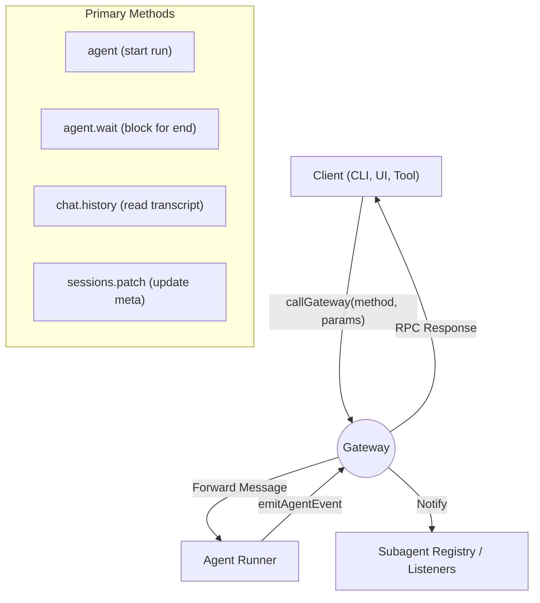

[← Go Back to Main Architecture](../README.md)

# The Gateway RPC Layer

The OpenClaw Gateway is a communication hub that enables different components of the system (CLI, agents, tools, and remote clients) to interact with each other. It uses a WebSocket-based RPC (Remote Procedure Call) layer for real-time, asynchronous communication.

## 1. Architecture Overview

The Gateway acts as a central server that manages connections, authentication, and command routing.

```
┌─────────────────┐     ┌─────────────────┐     ┌─────────────────┐
│   CLI/Client    │────▶│     Gateway     │────▶│   Agent Runner  │
│ (callGateway)   │◀────│   (WebSocket)   │◀────│ (emitAgentEvent)│
└─────────────────┘     └─────────────────┘     └─────────────────┘
```

-   **Transport**: WebSockets (WS/WSS) for persistent, low-latency communication.
-   **Protocol**: A JSON-RPC inspired protocol for requests and notifications.
-   **Security**: Supports Token and Password authentication, as well as TLS with fingerprint verification.



## 2. Key RPC Methods for A2A

While the gateway supports many methods, several are critical for the Agent-to-Agent architecture:

### 2.1 `agent`
Executes an agent run.
-   **Async**: Returns a `runId` immediately after the task is accepted and enqueued in a lane.
-   **Laning**: Allows specifying which execution lane to use (`main`, `subagent`, `cron`, `nested`).
-   **Idempotency**: Supports idempotency keys to prevent duplicate runs on network retry.

### 2.2 `agent.wait`
Blocks (up to a timeout) until a specific agent run completes.
-   **Return Value**: Provides the final status (`ok`, `error`, `timeout`) and timestamps.
-   **Usage**: Used by the `SubagentRegistry` to monitor background tasks.

### 2.3 `sessions.patch`
Updates session metadata in the Session Store.
-   **Usage**: Used by `sessions_spawn` to apply per-session models, labels, or thinking levels.

### 2.4 `sessions.delete`
Deletes a session and its associated transcript.
-   **Usage**: Used for cleanup of ephemeral subagent sessions.

### 2.5 `chat.history`
Retrieves the message history (transcript) for a session.
-   **Usage**: Used when a parent agent needs to read the detailed findings of a completed subagent.

## 3. The `callGateway` Helper

OpenClaw provides a `callGateway` function that abstracts away the complexity of connecting, authenticating, and handling timeouts.

```typescript
const result = await callGateway({
  method: "agent",
  params: {
    message: "Researching OpenClaw architecture...",
    sessionKey: "agent:researcher:subagent:123",
    lane: "subagent"
  }
});
```

-   **Automatic Auth**: Automatically picks up tokens/passwords from the environment or config.
-   **Tailnet Support**: Automatically detects and uses Tailscale IPs if configured.
-   **Retry Logic**: Handles connection closures and protocol version negotiation.

**Code References**:
- `src/gateway/call.ts`: The client-side helper for calling the gateway.
- `src/gateway/server.js`: The main WebSocket server implementation.
- `src/gateway/server-methods/`: Implementations for each RPC method.
