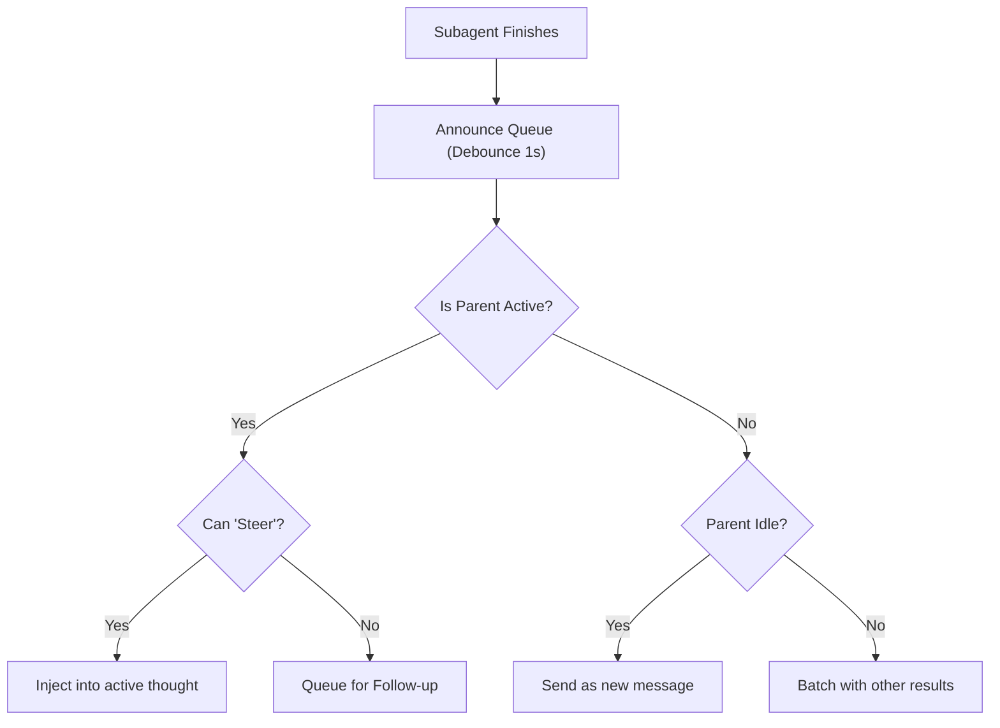

[← Go Back to Main Architecture](../README.md)

# Queue Modes and Message Steering

When a subagent completes its task, the result must be delivered back to the parent agent. OpenClaw uses a sophisticated "Announce Flow" and a queuing system to ensure results are delivered at the right time and in the right format, without interrupting the parent's current thought process unless necessary.

## 1. Queue Modes

The behavior of result delivery is controlled by the `queueMode` setting. This allows the system to balance real-time feedback with conversational flow.

| Mode | Behavior |
| :--- | :--- |
| `steer` | **Real-time Injection**: If the parent is currently active (running), the result is injected directly into its context window. If not, it may be dropped or stored. |
| `followup` | **Sequential Delivery**: The result is sent as a new message to the parent once it becomes idle, triggering a new run. |
| `collect` | **Batching**: Results from multiple subagents are collected and delivered as a single, summarized message. |
| `steer-backlog` | **Hybrid**: Attempts to `steer` the result if the parent is active; otherwise, it is queued for later delivery as a `followup`. |
| `interrupt` | **Force Delivery**: Queues the message and forces the parent to stop its current task and process the new information immediately. |
| `queue` | **FIFO**: Simple first-in, first-out queuing with no injection logic. |

## 2. Message Steering (The `steer` mechanism)

"Steering" is a unique feature of OpenClaw that allows for real-time interaction between agents.

-   **Context Injection**: Rather than sending a new message, steering appends information to the *current* turn's prompt while the LLM is already processing or between tool calls.
-   **Embedded Agent Support**: This is primarily handled via the `pi-embedded` runner, which can receive "steering messages" and incorporate them into the active inference loop.
-   **Benefits**: Steering allows the parent agent to react to subagent findings instantly, potentially dynamically adjusting its next steps without waiting for a full turn-around cycle.

## 3. The Announce Queue

To prevent overwhelming the parent agent with too many updates at once, the system uses an `AnnounceQueue`.

-   **Debouncing**: After a subagent finishes, the system waits for a short period (`queueDebounceMs`, default 1s) to see if other subagents also finish. This allows for batching multiple results into one summary.
-   **Capacity Limits**: The `queueCap` setting (default 20) prevents the queue from growing indefinitely, protecting the parent agent's context window.
-   **Drop Policy**: If the queue exceeds its capacity, the `queueDrop` policy determines whether to discard the oldest message (`old`), the newest one (`new`), or attempt to `summarize` the entire queue.

## 4. Trigger Message Construction

When a result is delivered (either via steering or followup), the system wraps the subagent's output in a "Trigger Message." This message provides the parent with:
-   A clear indicator of which task finished.
-   The final findings/output of the subagent.
-   Execution statistics (runtime, tokens, cost) for transparency.
-   **Instructions**: The parent is instructed to summarize this for the user or incorporate it into its current work.

**Code References**:
- `src/agents/subagent-announce-queue.ts`: Manages the queue and delivery logic.
- `src/agents/subagent-announce.ts`: Contains the logic for building trigger messages and deciding between steering and followup.
