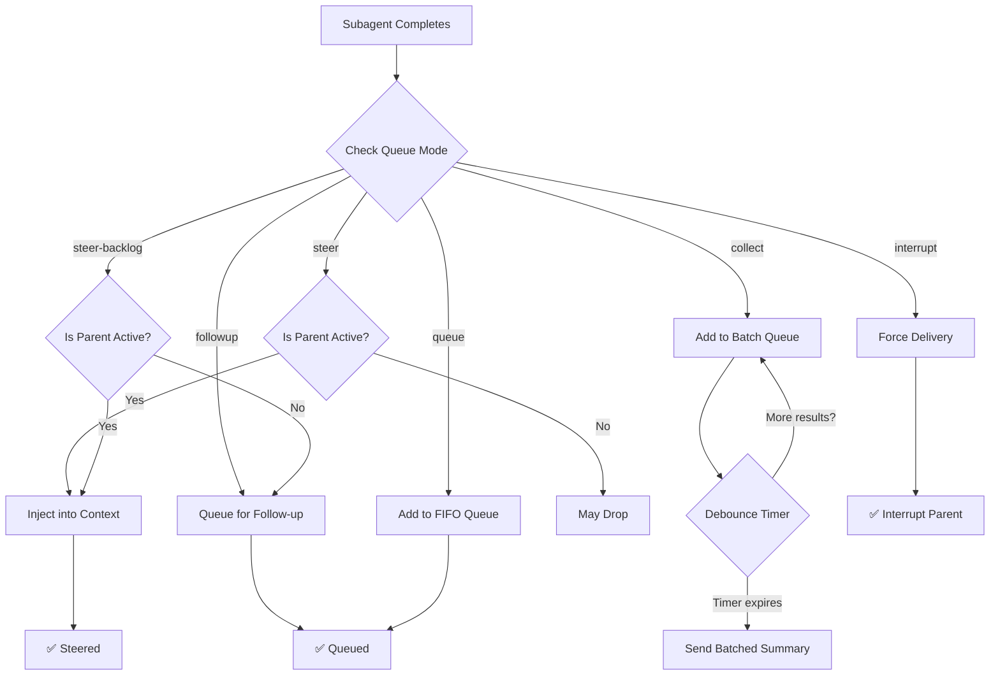
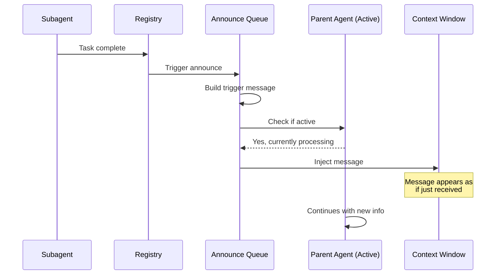
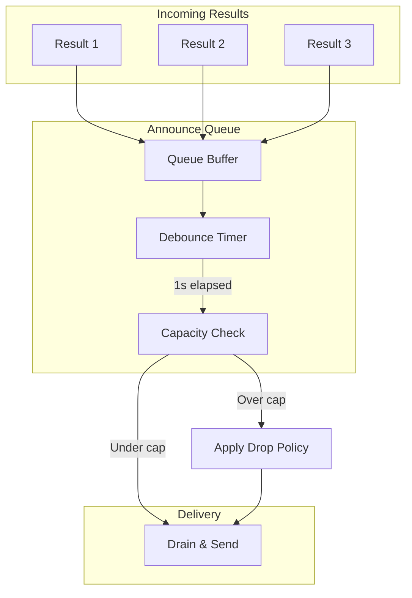
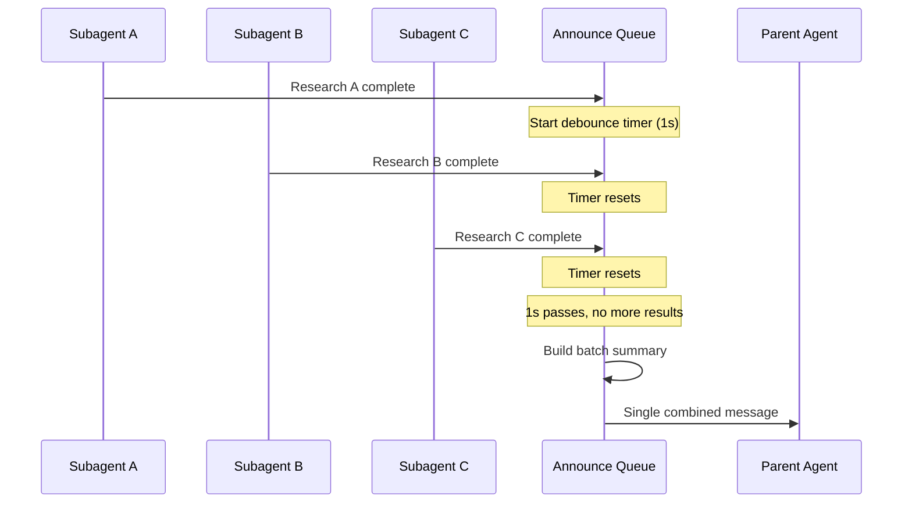

[← Go Back to Main Architecture](../README.md)

# Queue Modes and Message Steering

When a subagent completes its task, the result must be delivered back to the parent agent. OpenClaw uses a sophisticated "Announce Flow" and a queuing system to ensure results are delivered at the right time and in the right format, without interrupting the parent's current thought process unless necessary.

---

## Quick Reference

| Mode | When to Use |
|:-----|:------------|
| `steer` | Real-time injection when parent is active |
| `followup` | Send as new message when parent is idle |
| `collect` | Batch multiple results together |
| `steer-backlog` | Try steering, queue if parent idle |
| `interrupt` | Force immediate processing |
| `queue` | Simple FIFO, no special handling |

---

## 1. Queue Modes Comparison

| Mode | Parent Active | Parent Idle | Multiple Results | Best For |
|:-----|:--------------|:------------|:-----------------|:---------|
| `steer` | ✅ Inject into context | ❌ May drop | Individual | Real-time updates |
| `followup` | Queue | ✅ Send immediately | Individual | Non-urgent results |
| `collect` | Queue | ✅ Batch + send | Batched summary | Many subagents |
| `steer-backlog` | ✅ Inject | ✅ Queue for later | Individual | Flexible delivery |
| `interrupt` | Force stop | ✅ Send | Individual | Critical updates |
| `queue` | Queue | Queue | FIFO order | Simple scenarios |

---

## 2. Mode Decision Flowchart



---

## 3. Message Steering (The `steer` Mechanism)

Steering is a unique OpenClaw feature that allows real-time injection of information into an active agent's context.

### How Steering Works



### Steering Benefits

| Benefit | Description |
|:--------|:------------|
| **Instant Updates** | Parent sees results without waiting for turn to finish |
| **Contextual** | Information appears naturally in thought process |
| **Low Latency** | No round-trip through message queue |
| **Dynamic Adjustment** | Parent can adjust next steps based on findings |

### Steering Limitations

| Limitation | Workaround |
|:-----------|:-----------|
| Parent must be active | Use `steer-backlog` for fallback |
| Can't inject too much text | Keep subagent responses concise |
| Timing-dependent | Debounce helps batch rapid completions |

---

## 4. The Announce Queue

The announce queue prevents overwhelming the parent with too many updates.

### Queue Settings

```typescript
type QueueSettings = {
  mode: QueueMode;           // Delivery mode
  debounceMs?: number;       // Wait before draining (default: 1000)
  cap?: number;              // Max queue size (default: 20)
  dropPolicy?: "old" | "new" | "summarize";
};
```

### Queue Behavior



### Drop Policies

| Policy | Behavior | When to Use |
|:-------|:---------|:------------|
| `old` | Discard oldest messages | Recent info more valuable |
| `new` | Discard newest messages | First results more important |
| `summarize` | LLM summarizes queue | All info valuable, space limited |

---

## 5. Trigger Message Format

When a result is delivered, it's wrapped in a structured trigger message:

### Message Template

```
A background task "${label}" just ${statusLabel}.

Findings:
${reply || "(no output)"}

Stats: runtime ${duration} • tokens ${tokenCount} • est ${cost}

Summarize this naturally for the user. Keep it brief (1-2 sentences).
Do not mention technical details like tokens or stats.
You can respond with NO_REPLY if no announcement is needed.
```

### Example Trigger Message

```
A background task "Web Research" just completed successfully.

Findings:
The latest Node.js LTS version is 20.x (codename "Iron"). Key features include:
- Native test runner improvements
- Stable fetch and WebStreams APIs
- Performance improvements in V8 engine

Stats: runtime 45s • tokens 2.3k (in 1.8k / out 0.5k) • est $0.04

Summarize this naturally for the user. Keep it brief (1-2 sentences).
Do not mention technical details like tokens or stats.
You can respond with NO_REPLY if no announcement is needed.
```

### Parent's Natural Response

After receiving the trigger, the parent generates something like:

> "I found that Node.js 20 is the latest LTS version, featuring improved native test runners and stable fetch APIs!"

---

## 6. Collect Mode: Batching Results

When using `collect` mode, multiple subagent results are combined:



### Batch Message Format

```
Multiple background tasks completed:

1. "Research A" - completed successfully
   Found: Latest React version is 18.2...

2. "Research B" - completed successfully
   Found: Vue.js 3.4 was released...

3. "Research C" - completed with error
   Error: API rate limit exceeded

Summarize these findings for the user.
```

---

## 7. Configuration Example

```yaml
agents:
  defaults:
    subagents:
      announce:
        mode: steer-backlog      # Try steering, queue if idle
        debounceMs: 1000         # Wait 1s for batching
        cap: 20                  # Max 20 queued messages
        dropPolicy: summarize    # LLM summarize if over cap
```

---

## 8. When to Use Each Mode

| Scenario | Recommended Mode | Reason |
|:---------|:-----------------|:-------|
| Single urgent research task | `steer` | Real-time result while user waits |
| Multiple parallel research | `collect` | Batch results into one update |
| Non-urgent background work | `followup` | Don't interrupt current work |
| Critical alerts | `interrupt` | Must be seen immediately |
| Flexible/default | `steer-backlog` | Best of both worlds |

---

## Code References

- **Announce Queue**: `src/agents/subagent-announce-queue.ts`
- **Announce Logic**: `src/agents/subagent-announce.ts`
- **Queue Utilities**: `src/auto-reply/reply/queue/`
