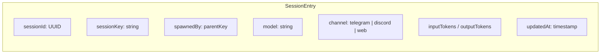
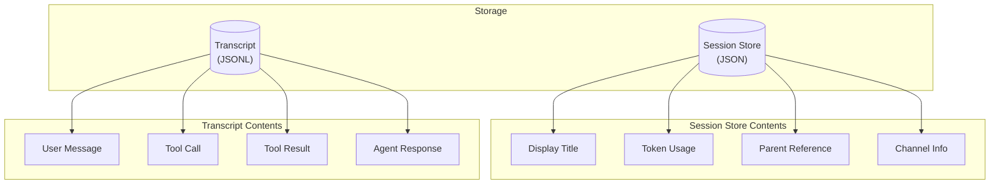
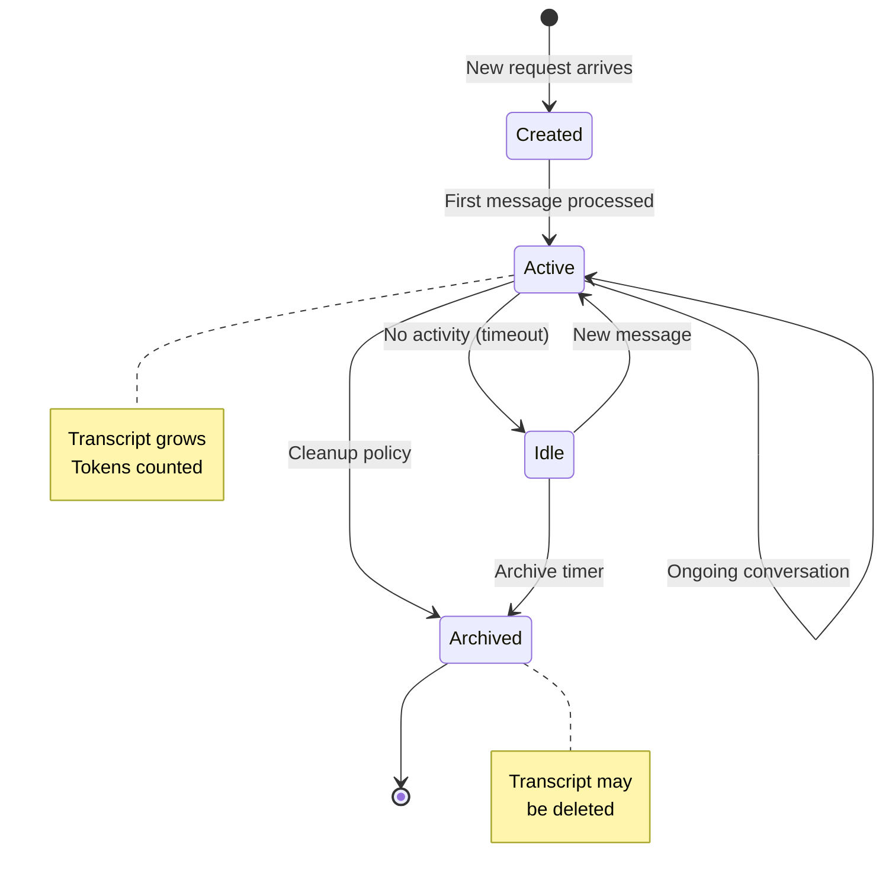
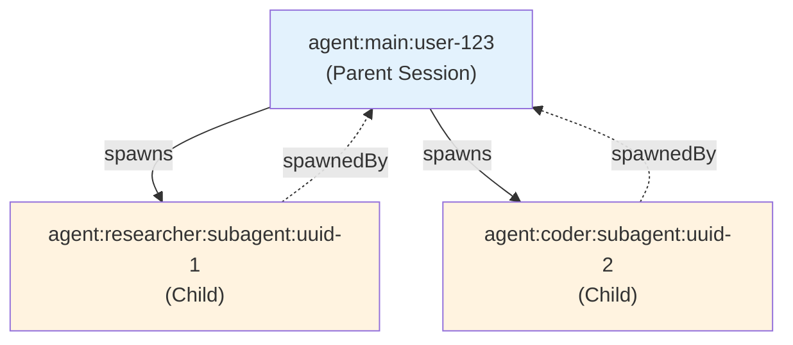

[← Go Back to Main Architecture](../README.md)

# Session Management in OpenClaw

Sessions are the core mechanism for maintaining state and context across multiple interactions between users and agents, or between agents themselves. This document explains the structure, management, and persistence of sessions.

---

## Quick Reference

| Concept | Description |
|:--------|:------------|
| **Session Key** | Unique string identifying a conversation context |
| **Session Entry** | Metadata object stored in the Session Store |
| **Transcript** | JSONL file containing the full conversation history |

---

## 1. Session Key Format

The session key is a unique string that identifies a specific conversation context. It follows a structured format that helps determine the agent and the nature of the conversation.

### Key Formats

| Format | Example | Description |
|:-------|:--------|:------------|
| `agent:<agentId>:<slug>` | `agent:main:telegram-123` | Standard session for a specific agent |
| `agent:<agentId>:subagent:<uuid>` | `agent:coder:subagent:a1b2-c3d4` | Session created for a subagent task |
| `main` | `main` | Alias for the default agent's main session |
| `global` | `global` | Shared context (context-dependent) |

### Session Key Anatomy

```
agent:coder:subagent:a1b2c3d4-e5f6-7890-abcd-ef1234567890
│     │     │        └───────────────┬───────────────────┘
│     │     │                        │
│     │     │                   Unique UUID
│     │     │
│     │     └── Session Type: "subagent" indicates spawned task
│     │
│     └── Agent ID: Which agent handles this session
│
└── Prefix: Always "agent" for agent sessions
```

### Slug Patterns

Slugs can encode additional context about the session:

| Pattern | Example | Meaning |
|:--------|:--------|:--------|
| Channel + ID | `telegram-123456` | Telegram user DM |
| Channel + Group | `telegram:group:-1001234567` | Telegram group chat |
| Channel + Thread | `discord:thread:987654` | Discord thread |
| Custom label | `research-project-alpha` | User-defined context |

---

## 2. Session Entry Structure

Every session is represented by a `SessionEntry` object, which stores metadata about the conversation.

### Key Metadata Fields



| Field | Type | Description |
|:------|:-----|:------------|
| `sessionId` | `string` | Unique UUID assigned to the session |
| `sessionKey` | `string` | Canonical key (as described above) |
| `updatedAt` | `number` | Timestamp of last activity |
| `spawnedBy` | `string` | Parent's session key (for subagents) |
| `label` | `string` | Human-readable label (e.g., "Bug discovery") |
| `model` | `string` | Active AI model for this session |
| `modelProvider` | `string` | Provider (anthropic, openai, etc.) |
| `channel` | `string` | Communication channel (telegram, discord, webchat) |
| `inputTokens` | `number` | Total input tokens used |
| `outputTokens` | `number` | Total output tokens used |
| `totalTokens` | `number` | Combined token count |

---

## 3. Persistence Layer

OpenClaw uses a two-part persistence strategy for sessions:



### The Session Store (JSON)

Metadata for all sessions is stored in a JSON file (the "Session Store").

| Aspect | Details |
|:-------|:--------|
| **Location** | `~/.openclaw/sessions.json` or split per agent |
| **Purpose** | Fast lookup of session metadata |
| **Contents** | Titles, usage stats, relationships, channel info |
| **Merging** | Entries merged by `updatedAt` timestamp |

### Transcripts (JSONL)

The actual conversation history is stored in JSONL (JSON Lines) files.

| Aspect | Details |
|:-------|:--------|
| **Location** | `~/.clawdbot/agents/<agentId>/sessions/<sessionId>.jsonl` |
| **Format** | One JSON object per line |
| **Contents** | Full `AgentEvent` payloads (messages, tools, results) |
| **Benefits** | Efficient append, streaming reads |

### Example Transcript Entry

```json
{"runId":"abc-123","seq":1,"stream":"assistant","ts":1706621234567,"data":{"phase":"text","text":"Hello! How can I help?"}}
{"runId":"abc-123","seq":2,"stream":"tool","ts":1706621235000,"data":{"phase":"start","name":"web_search","args":{"query":"OpenClaw docs"}}}
{"runId":"abc-123","seq":3,"stream":"tool","ts":1706621236500,"data":{"phase":"result","result":"Found 5 results..."}}
```

---

## 4. Session Lifecycle



---

## 5. Title Derivation

To make sessions recognizable in the UI, OpenClaw automatically derives a display title:

### Priority Order

| Priority | Source | Example |
|:---------|:-------|:--------|
| 1 | Manual `label` or `displayName` | "Project Alpha Research" |
| 2 | `subject` field | "Re: Bug Report #123" |
| 3 | First user message (summarized) | "How do I configure..." |
| 4 | Truncated `sessionId` | "a1b2c3d4..." |

---

## 6. Session Relationships

Sessions can have parent-child relationships, especially in the A2A architecture:



The `spawnedBy` field in child sessions points back to the parent, enabling:
- Result delivery to the correct parent
- Cleanup of child sessions when parent completes
- Tracking of delegation chains

---

## Code Reference

- **Session Entry Type**: `src/config/sessions/types.ts`
- **Title Derivation**: `src/gateway/session-utils.ts` (`deriveSessionTitle`)
