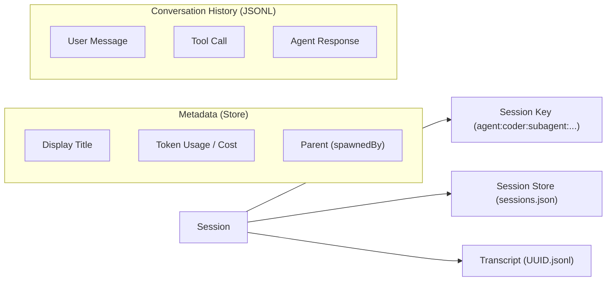

[← Go Back to Main Architecture](../README.md)

# Session Management in OpenClaw

Sessions are the core mechanism for maintaining state and context across multiple interactions between users and agents, or between agents themselves. This document explains the structure, management, and persistence of sessions.

## 1. Session Key Format

The session key is a unique string that identifies a specific conversation context. It follows a structured format that helps determine the agent and the nature of the conversation.

| Format | Example | Description |
| :--- | :--- | :--- |
| `agent:<agentId>:<slug>` | `agent:main:telegram-123` | A standard session for a specific agent. |
| `agent:<agentId>:subagent:<uuid>` | `agent:coder:subagent:a1b2-c3d4` | A session created for a subagent task. |
| `main` | `main` | An alias for the primary/default agent's main session. |
| `global` | `global` | A shared context accessible by multiple agents (context-dependent). |

**Note**: Slugs can include channel identifiers, user IDs, or group IDs (e.g., `telegram:group:-1001234567`).

## 2. Session Entry Structure

Every session is represented by a `SessionEntry` object, which stores metadata about the conversation.

### 2.1 Key Metadata Fields

- `sessionId`: A unique UUID assigned to the session.
- `updatedAt`: Timestamp of the last activity in the session.
- `spawnedBy`: The session key of the "parent" agent (essential for subagent tracking).
- `label`: A human-readable label for the session (e.g., "Bug discovery").
- `model` / `modelProvider`: The specific AI model being used for this session.
- `inputTokens` / `outputTokens` / `totalTokens`: Usage stats for cost tracking and context management.
- `channel`: The communication channel (e.g., `telegram`, `discord`, `webchat`).

**Code Reference**: The `SessionEntry` type is defined in `src/config/sessions/types.ts`.

## 3. Persistence Layer

OpenClaw uses a two-part persistence strategy for sessions:

### 3.1 The Session Store (JSON)

Metadata for all sessions is stored in a JSON file (the "Session Store"). The path is usually configurable and defaults to `~/.openclaw/sessions.json` or split per agent.

- **Fast Lookup**: Allows the gateway and agents to quickly find metadata, resolve titles, and list available sessions without reading large transcript files.
- **Entry Merging**: When multiple processes update the store, entries are merged based on the `updatedAt` timestamp to ensure consistency.

### 3.2 Transcripts (JSONL)

The actual conversation history (messages, tool calls, results) is stored in JSONL (JSON Lines) files.

- **Location**: Typically stored under `~/.clawdbot/agents/<agentId>/sessions/<sessionId>.jsonl`.
- **Streaming-Friendly**: Appending new messages is efficient, and reading the history can be done line-by-line.
- **Content**: Each line is an `AgentEvent` payload, capturing the full interaction lifecycle.

## 4. Title Derivation

To make sessions recognizable in the UI, OpenClaw automatically derives a display title:
1.  **Manual Label**: Uses the `label` or `displayName` if set.
2.  **Subject**: Uses the `subject` field (common in groups/emails).
3.  **Content-Based**: Summarizes the first user message in the transcript.
4.  **Fallback**: Uses a truncated version of the `sessionId`.

**Code Reference**: `src/gateway/session-utils.ts` contains the `deriveSessionTitle` logic.
