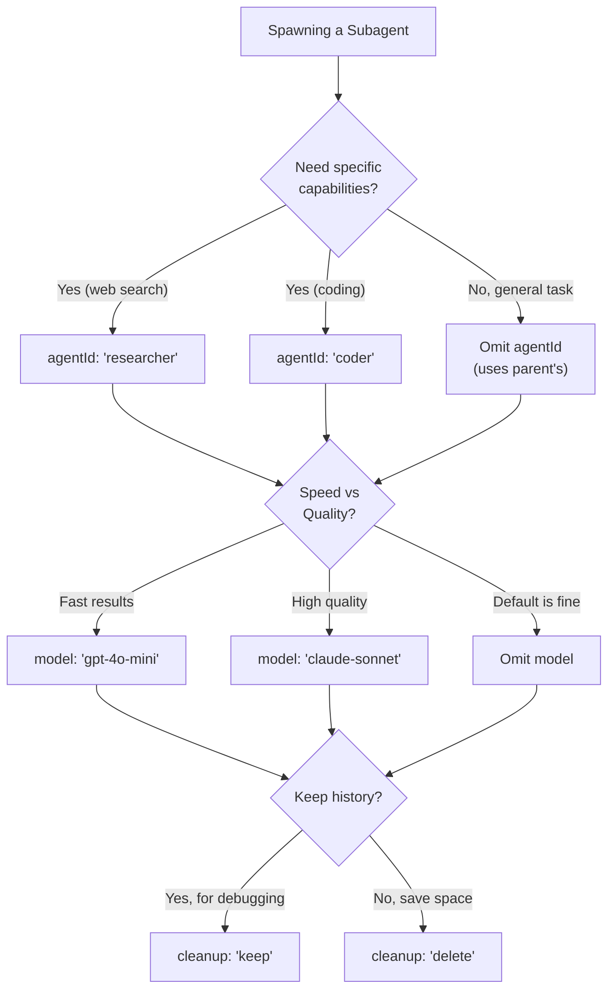
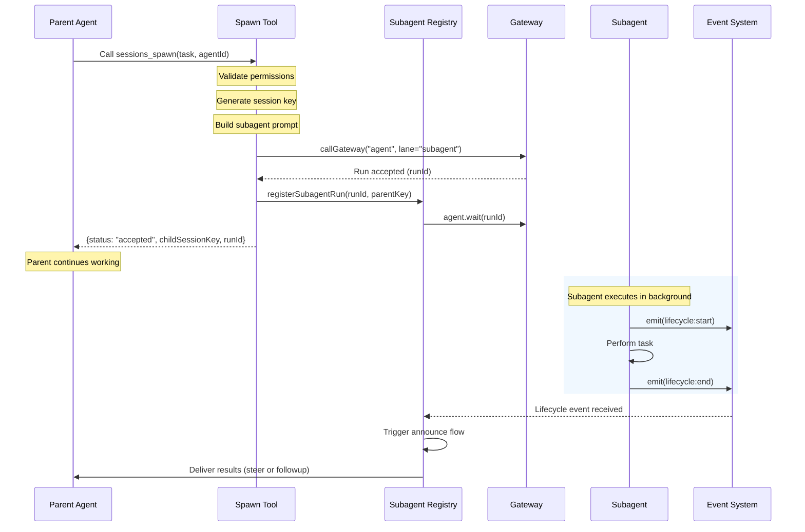

[← Go Back to Main Architecture](../README.md)

# The `sessions_spawn` Tool

The `sessions_spawn` tool is the primary mechanism for implementing the Agent-to-Agent (A2A) pattern in OpenClaw. It allows an agent (the "Parent") to delegate a specific task to a background process (the "Subagent") running in an isolated session.

---

## Quick Reference

| What | Details |
|:-----|:--------|
| **Purpose** | Delegate tasks to background subagents |
| **Returns** | Immediately with `runId` (async execution) |
| **Blocking** | No - parent continues while subagent works |
| **Results** | Delivered via announce flow when complete |

---

## 1. Parameters

| Parameter | Type | Required | Default | Description |
|:----------|:-----|:---------|:--------|:------------|
| `task` | `string` | ✓ | - | Natural language instruction for the subagent |
| `label` | `string` | | `null` | Short name for the task (e.g., "Web Research") |
| `agentId` | `string` | | Parent's ID | Target agent profile to use |
| `model` | `string` | | Configured default | Override AI model (e.g., `openai/gpt-4o`) |
| `thinking` | `string` | | - | Override thinking level (e.g., `high`) |
| `runTimeoutSeconds` | `number` | | Configured default | Max execution time before auto-kill |
| `cleanup` | `"keep"` \| `"delete"` | | `keep` | Whether to delete session after completion |

### Parameter Decision Guide



---

## 2. Safety and Policies

### Recursion Guard

Subagents are explicitly **forbidden** from using `sessions_spawn`. This prevents infinite spawning loops.

```
Parent Agent
    └── spawns → Subagent A
                    └── ❌ CANNOT spawn → Subagent B
```

**Detection Method**: The system checks if the requester's session key contains `:subagent:`. If so, the request is rejected with `status: "forbidden"`.

### Permission Checks

When a parent requests a specific `agentId`, the system validates against `subagents.allowAgents`:

| Parent's Config | Request `agentId: "coder"` | Result |
|:----------------|:---------------------------|:-------|
| `allowAgents: ["*"]` | ✅ Allowed | Spawns coder |
| `allowAgents: ["coder", "researcher"]` | ✅ Allowed | Spawns coder |
| `allowAgents: ["researcher"]` | ❌ Forbidden | Error returned |
| `allowAgents: undefined` | ❌ Forbidden | Can only spawn self |

---

## 3. Execution Flow



### Step-by-Step Breakdown

| Step | Component | Action |
|:-----|:----------|:-------|
| 1 | Spawn Tool | Validate recursion guard and permissions |
| 2 | Spawn Tool | Generate unique key: `agent:<id>:subagent:<uuid>` |
| 3 | Spawn Tool | Build specialized subagent system prompt |
| 4 | Gateway | Route to `subagent` lane (non-blocking) |
| 5 | Registry | Track run with parent reference |
| 6 | Parent | Receives confirmation, continues work |
| 7 | Subagent | Executes task in isolated session |
| 8 | Event System | Emits lifecycle events as subagent progresses |
| 9 | Registry | Detects completion, triggers announce flow |
| 10 | Parent | Receives results via steering or follow-up |

---

## 4. Return Value

The tool returns **immediately** after the subagent's execution has been *accepted*:

```json
{
  "status": "accepted",
  "childSessionKey": "agent:coder:subagent:a1b2c3d4-e5f6-7890-abcd-ef1234567890",
  "runId": "uuid-of-the-run",
  "modelApplied": true
}
```

| Field | Description |
|:------|:------------|
| `status` | `"accepted"` (success) or `"forbidden"` (permission denied) |
| `childSessionKey` | Full session key of the spawned subagent |
| `runId` | UUID to track this specific execution |
| `modelApplied` | Whether a model override was successfully applied |

### Error Response

If spawning fails:

```json
{
  "status": "forbidden",
  "error": "Agent 'coder' not in allowAgents list. Allowed: ['researcher']"
}
```

---

## 5. Example Use Cases

### Research Task

```
sessions_spawn(
  task: "Search the web for the latest Node.js LTS version and summarize the key features",
  label: "Node.js Research",
  agentId: "researcher",
  model: "gpt-4o-mini"
)
```

### Code Analysis

```
sessions_spawn(
  task: "Read the file src/index.ts and identify any potential security issues",
  label: "Security Audit",
  agentId: "coder",
  runTimeoutSeconds: 300
)
```

### Quick Summary

```
sessions_spawn(
  task: "Summarize the contents of README.md in 3 bullet points",
  label: "README Summary",
  cleanup: "delete"
)
```

---

## 6. When to Spawn vs Direct Tool Use

| Scenario | Use `sessions_spawn` | Use Direct Tool |
|:---------|:---------------------|:----------------|
| Task takes > 30 seconds | ✅ Yes | ❌ No |
| Need different agent capabilities | ✅ Yes | ❌ No |
| Want to parallelize work | ✅ Yes | ❌ No |
| Simple, quick operation | ❌ No | ✅ Yes |
| Need result immediately | ❌ No | ✅ Yes |
| Task requires conversation context | ❌ No | ✅ Yes |

---

## Code Reference

- **Tool Implementation**: `src/agents/tools/sessions-spawn-tool.ts`
