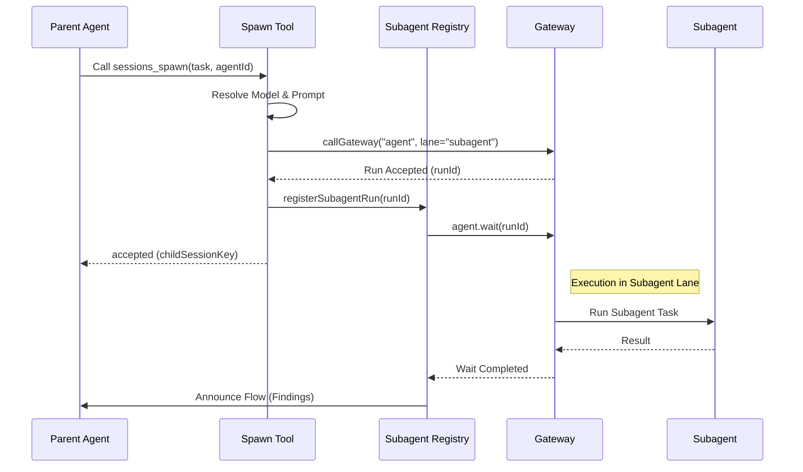

[← Go Back to Main Architecture](../README.md)

# The `sessions_spawn` Tool

The `sessions_spawn` tool is the primary mechanism for implementing the Agent-to-Agent (A2A) pattern in OpenClaw. It allows an agent (the "Parent") to delegate a specific task to a background process (the "Subagent") running in an isolated session.

## 1. Parameters

The tool accepts the following parameters:

| Parameter | Type | Required | Description |
| :--- | :--- | :--- | :--- |
| `task` | `string` | ✓ | The natural language instruction describing what the subagent should do. |
| `label` | `string` | | A short, human-readable name for the task (e.g., "Web Research"). |
| `agentId` | `string` | | The ID of the agent profile to use. Defaults to the same ID as the parent. |
| `model` | `string` | | Override for the subagent's AI model (e.g., `openai/gpt-4o`). |
| `thinking` | `string` | | Override for the thinking level (e.g., `high`). |
| `runTimeoutSeconds` | `number` | | Max execution time before the subagent is automatically killed. |
| `cleanup` | `"keep" \| "delete"` | | Whether to delete the session and transcript after completion. Default: `keep`. |

## 2. Safety and Policies

To ensure stability and security, several guardrails are in place:

### 2.1 Recursion Guard
Subagents are explicitly forbidden from using the `sessions_spawn` tool. This prevent "infinite spawning" loops where agents might create an uncontrollable number of background tasks.

### 2.2 Permission Checks
When a parent agent requests a specific `agentId`, the system checks its `subagents.allowAgents` policy:
-   If the target agent is not in the allowed list, the request is rejected with a `forbidden` status.
-   The parent is informed of the allowed agent IDs to help it choose a correct specialist.



## 3. Execution Process

When the tool is executed:
1.  **Unique Session Key**: A new key is generated: `agent:<targetAgentId>:subagent:<uuid>`.
2.  **Specialized Prompt**: A specialized "Subagent System Prompt" is built, emphasizing the ephemeral nature and task-focused role of the subagent.
3.  **Gateway Dispatch**: The system calls the Gateway's `agent` method, specifying:
    -   `lane: subagent`: Ensures the task runs in parallel without blocking the main conversation.
    -   `deliver: false`: Prevents the subagent's raw output from being sent directly to the user.
4.  **Registration**: The run is recorded in the `SubagentRegistry` which monitors the subagent's lifecycle events (`start`, `end`, `error`).

## 4. Return Value

The tool returns immediately after the subagent's execution has been *accepted* by the system:

```json
{
  "status": "accepted",
  "childSessionKey": "agent:coder:subagent:a1b2c3d4-...",
  "runId": "uuid-of-the-run",
  "modelApplied": true
}
```

The parent agent can then continue its work. When the subagent finishes, the system will automatically delivering the result back to the parent using the "Announce Flow".

**Code Reference**: `src/agents/tools/sessions-spawn-tool.ts`.
