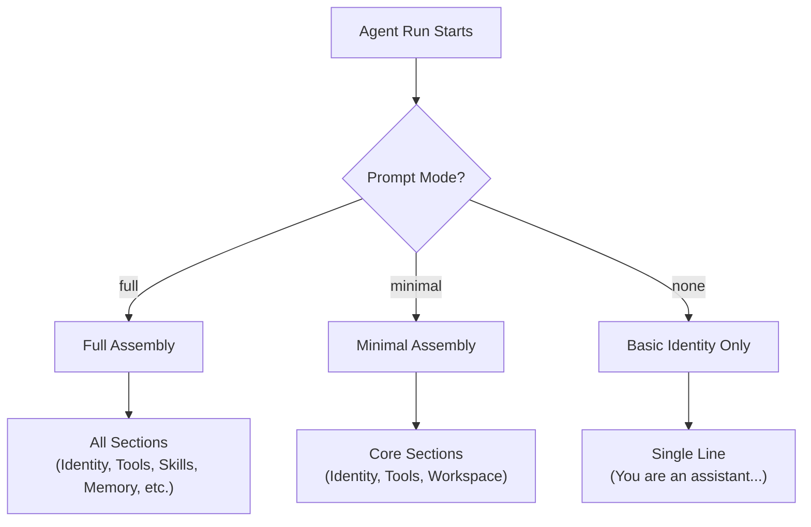
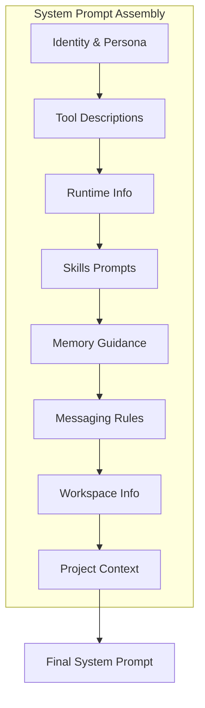

[← Go Back to Main Architecture](../README.md)

# System Prompt Construction

The system prompt is the foundational instruction set for every agent run in OpenClaw. It is dynamically constructed to provide the model with the necessary context, tool descriptions, and operational rules while remaining efficient in terms of token usage.

---

## Quick Reference

| Mode | Token Usage | Use Case |
|:-----|:------------|:---------|
| `full` | High | Main agent sessions |
| `minimal` | Low | Subagents, background tasks |
| `none` | Minimal | Highly specialized runs |

---

## 1. Prompt Modes

The complexity of the system prompt is determined by the `PromptMode`:



### Mode Comparison

| Section | `full` | `minimal` | `none` |
|:--------|:------:|:---------:|:------:|
| Identity & Persona | ✅ | ✅ | ✅ |
| Tool Descriptions | ✅ | ✅ | ❌ |
| Workspace Info | ✅ | ✅ | ❌ |
| Runtime Environment | ✅ | ❌ | ❌ |
| Skills & Memory | ✅ | ❌ | ❌ |
| Messaging & Channels | ✅ | ❌ | ❌ |
| Project Context | ✅ | ❌ | ❌ |

---

## 2. Prompt Sections

A `full` system prompt consists of several modular sections:



---

### 2.1 Identity and Persona

Defines who the agent is and its personality.

**Example Content:**
```
You are a personal assistant running inside OpenClaw.
You are helpful, knowledgeable, and direct.
Your name is "Guardian" and you help the user with various tasks.
```

**Source:** Agent config `name`, `identity.soul`, or `SOUL.md` file.

---

### 2.2 Tool Descriptions

Lists available tools with brief summaries.

**Example Content:**
```
## Available Tools

- **read**: Read file contents from the workspace
- **write**: Write content to a file
- **exec**: Execute shell commands
- **web_search**: Search the web for information
- **sessions_spawn**: Delegate tasks to background subagents
```

**Note:** Only tools allowed by the agent's policy are listed.

---

### 2.3 Runtime Environment

Provides context about the execution environment.

**Example Content:**
```
## Runtime Information

- Agent ID: main
- Host: my-server
- OS: Linux
- Model: anthropic/claude-sonnet
- Workspace: /home/user/projects
- Current Time: 2024-01-30 10:00:00 UTC
```

---

### 2.4 Skills and Memory

Instructions for using skill documentation and memory.

**Example Content:**
```
## Skills

You have access to skill documentation in ~/.openclaw/skills/.
To use a skill, read its SKILL.md file first.

## Memory

Use memory_search to find relevant past information.
Memory entries contain learnings from previous sessions.
```

---

### 2.5 Messaging and Delivery

Rules for message delivery across channels.

**Example Content:**
```
## Messaging

Current channel: telegram (user: @username)
To reply in this conversation, just respond normally.
To send proactive messages, use the message tool.

Channel capabilities:
- Supports: text, images, reactions
- Does not support: inline buttons
```

---

### 2.6 Project Context

Injected content from project-specific files.

**Example Content:**
```
## Project Context

### README.md
This project is a task management API built with Node.js...

### TODO.md
- [ ] Add user authentication
- [ ] Implement rate limiting
```

**Source:** Files specified in config `contextFiles` or auto-detected.

---

## 3. Subagent Prompting

Subagents receive a `minimal` prompt plus a "Subagent Context" block emphasizing their limited role:

### Subagent Context Block

```
# Subagent Context

You are a **subagent** spawned by the main agent for a specific task.

## Your Role
- You were created to handle: "${task}"
- Complete this task. That's your entire purpose.
- You are NOT the main agent. Don't try to be.

## Rules
1. **Stay focused** - Do your assigned task, nothing else
2. **Complete the task** - Your final message will be automatically reported
3. **Don't initiate** - No heartbeats, no proactive actions, no side quests
4. **Be ephemeral** - You may be terminated after completion. That's fine.

## Output Format
When complete, your final response should include:
- What you accomplished or found
- Any relevant details the main agent should know
- Keep it concise but informative

## What You DON'T Do
- ❌ User conversations (main agent's job)
- ❌ External messages (unless explicitly tasked)
- ❌ Cron jobs or persistent state
- ❌ Pretending to be the main agent
- ❌ Using the message tool directly

## Session Context
- Label: ${label}
- Requester: ${requesterSessionKey}
- Your session: ${childSessionKey}
```

### Why Minimal Prompts for Subagents?

| Benefit | Explanation |
|:--------|:------------|
| **Lower cost** | Fewer input tokens = lower API costs |
| **Faster start** | Less processing before first response |
| **Better focus** | Limited context = more attention on task |
| **Reduced confusion** | No irrelevant rules or capabilities |

---

## 4. Reasoning and Thinking Tags

The prompt includes instructions for structured output when extended thinking is enabled:

### With Thinking Tags

```
When reasoning through a problem:
1. Wrap your internal reasoning in <think>...</think> tags
2. Place your final response in <final>...</final> tags

The <think> content will be captured but hidden from the user.
The <final> content is what the user sees.
```

### Example Agent Output

```
<think>
The user is asking about Node.js LTS versions.
Let me search for the latest information...
Found: Node.js 20 is the current LTS.
</think>

<final>
The current Node.js LTS version is 20 (codename "Iron"), 
released in October 2023. It includes improved native 
test runners and stable fetch APIs.
</final>
```

---

## 5. Dynamic Injection

The system prompt can be dynamically extended at runtime:

### Extra System Prompt

Used when spawning subagents or special tasks:

```typescript
await callGateway({
  method: "agent",
  params: {
    message: task,
    sessionKey: childSessionKey,
    extraSystemPrompt: "Focus only on web research. Do not write code."
  }
});
```

### Context File Injection

Project-specific context can be injected:

```yaml
agents:
  list:
    - id: main
      contextFiles:
        - "README.md"
        - "ARCHITECTURE.md"
        - "docs/API.md"
```

These files are read and included in the system prompt under "Project Context".

---

## 6. Token Efficiency Tips

| Strategy | Benefit |
|:---------|:--------|
| Use `minimal` mode for subagents | 50-70% token reduction |
| Limit context files | Only include essential docs |
| Trim skill descriptions | Load skill details on-demand |
| Compress runtime info | Only include necessary details |

---

## Code Reference

- **Prompt Assembly**: `src/agents/system-prompt.ts`
- **Section Builders**: `src/agents/system-prompt-sections/`
