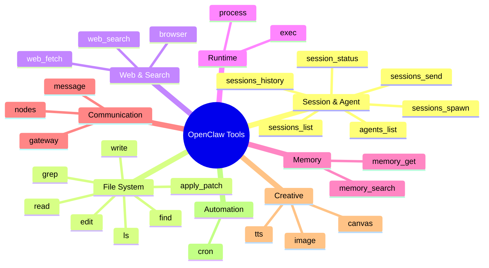

[← Go Back to Main Architecture](../README.md)

# Complete Tool Reference

OpenClaw provides a comprehensive suite of tools categorized by their functionality. This reference lists all native tools and their primary purposes.

---

## Tool Categories Overview



---

## 1. Session & Agent Tools

Used for managing conversations and delegating tasks to other agents.

| Tool | Purpose | Common Usage |
|:-----|:--------|:-------------|
| `sessions_spawn` | Delegate task to background subagent | Research, long-running analysis |
| `agents_list` | List available agent profiles | Check before spawning |
| `sessions_list` | Find existing sessions | Review conversation history |
| `sessions_history` | Read session transcript | Retrieve subagent findings |
| `sessions_send` | Send message to session | Inter-agent communication |
| `session_status` | Get current session info | Check model, tokens, status |

### Example: Spawning a Research Task

```
Tool: sessions_spawn
Args: {
  "task": "Research the latest React version and key features",
  "label": "React Research",
  "agentId": "researcher"
}
```

---

## 2. File System Tools

Used for interacting with files in the agent's workspace.

| Tool | Purpose | Common Usage |
|:-----|:--------|:-------------|
| `read` | Read file contents | View source code, configs |
| `write` | Create/overwrite file | Generate new files |
| `edit` | Precise multi-line edits | Modify existing code |
| `apply_patch` | Apply unified diff | Batch changes from diff |
| `ls` | List directory contents | Explore file structure |
| `find` | Search by name/glob | Locate files |
| `grep` | Search inside files | Find code patterns |

### Example: Reading and Editing a File

```
Tool: read
Args: { "path": "src/config.ts" }

Tool: edit
Args: {
  "path": "src/config.ts",
  "edits": [
    { "oldText": "debug: false", "newText": "debug: true" }
  ]
}
```

---

## 3. Runtime & Process Tools

Used for executing commands and managing long-running processes.

| Tool | Purpose | Common Usage |
|:-----|:--------|:-------------|
| `exec` | Execute shell command | Run scripts, build commands |
| `process` | Manage background processes | Monitor, send input, kill |

### Example: Running a Build Command

```
Tool: exec
Args: {
  "command": "npm run build",
  "cwd": "/project",
  "background": false
}
```

### Example: Managing Background Process

```
Tool: exec
Args: { "command": "npm run dev", "background": true }
Returns: { "pid": 12345 }

Tool: process
Args: { "pid": 12345, "action": "status" }

Tool: process
Args: { "pid": 12345, "action": "kill" }
```

---

## 4. Web & Search Tools

Used for gathering information from the internet.

| Tool | Purpose | Common Usage |
|:-----|:--------|:-------------|
| `web_search` | Search the web | Find documentation, news |
| `web_fetch` | Fetch URL content | Read web pages as markdown |
| `browser` | Full browser automation | Screenshots, clicks, forms |

### Example: Web Research Workflow

```
Tool: web_search
Args: { "query": "Node.js LTS version 2024" }
Returns: [{ "url": "https://nodejs.org/..." }, ...]

Tool: web_fetch
Args: { "url": "https://nodejs.org/en/about/releases" }
Returns: { "content": "# Node.js Release Schedule..." }
```

### Example: Browser Automation

```
Tool: browser
Args: {
  "action": "navigate",
  "url": "https://example.com/login"
}

Tool: browser
Args: {
  "action": "type",
  "selector": "#email",
  "text": "user@example.com"
}

Tool: browser
Args: { "action": "screenshot" }
```

---

## 5. Memory & Knowledge Tools

Used for long-term information storage and retrieval.

| Tool | Purpose | Common Usage |
|:-----|:--------|:-------------|
| `memory_search` | Search agent memory | Find past learnings |
| `memory_get` | Retrieve specific entries | Get detailed memory blocks |

### Example: Memory Usage

```
Tool: memory_search
Args: { "query": "user preferences" }
Returns: ["memory_001", "memory_042"]

Tool: memory_get
Args: { "id": "memory_001" }
Returns: { "content": "User prefers dark mode..." }
```

---

## 6. Communication & Messaging Tools

Used for interacting with external platforms.

| Tool | Purpose | Common Usage |
|:-----|:--------|:-------------|
| `message` | Send to external channels | Telegram, Signal, Discord |
| `gateway` | Manage OpenClaw service | Restart, update, config |
| `nodes` | Interact with devices | Camera, screen, notifications |

### Example: Sending a Message

```
Tool: message
Args: {
  "channel": "telegram",
  "target": "123456789",
  "text": "Task completed successfully!"
}
```

---

## 7. Creative & Multimedia Tools

Used for generating and analyzing images or interactive UI.

| Tool | Purpose | Common Usage |
|:-----|:--------|:-------------|
| `image` | Generate/analyze images | AI art, image description |
| `canvas` | Create interactive UI | Visualizations, widgets |
| `tts` | Text-to-speech synthesis | Audio generation |

### Example: Image Generation

```
Tool: image
Args: {
  "action": "generate",
  "prompt": "A serene mountain landscape at sunset"
}
Returns: { "path": "/tmp/generated_image.png" }
```

---

## 8. Automation Tools

Used for scheduling and background triggers.

| Tool | Purpose | Common Usage |
|:-----|:--------|:-------------|
| `cron` | Schedule tasks | Reminders, recurring jobs |

### Example: Scheduling a Reminder

```
Tool: cron
Args: {
  "action": "create",
  "schedule": "in 2 hours",
  "task": "Remind user to check build status"
}
```

---

## Tool Availability

> **Note**: Tool availability depends on:
> 1. **Agent's Tool Profile** (minimal, coding, full, etc.)
> 2. **Agent's Tool Policy** (allow/deny lists)
> 3. **Sandbox Configuration** (if enabled)

### Checking Available Tools

The agent can check its available tools via the system prompt or by attempting to use a tool and receiving a permission error.

---

## Related Documentation

- [Tool System](tool-system.md) - How tool policies work
- [Agent Configuration](agent-configuration.md) - Configuring tool access
- [Sessions Spawn Tool](sessions-spawn-tool.md) - Detailed spawn documentation
