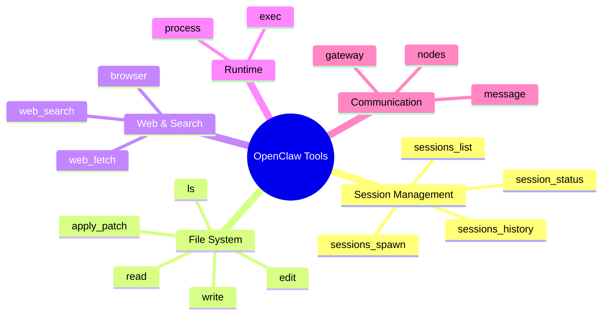

[← Go Back to Main Architecture](../README.md)

# Complete Tool Reference

OpenClaw provides a comprehensive suite of tools categorized by their functionality. This reference lists all native tools and their primary purposes.

## 1. Session & Agent Tools
Used for managing conversations and delegating tasks to other agents.

| Tool | Purpose |
| :--- | :--- |
| `sessions_spawn` | Delegate a task to a background subagent in an isolated session. |
| `agents_list` | List all agent profiles that are allowed to be spawned. |
| `sessions_list` | Find existing sessions (main, subagent, or groups) with filters. |
| `sessions_history` | Retrieve the full conversation transcript of another session. |
| `sessions_send` | Send a message/instruction to an already running session. |
| `session_status` | View detailed usage, model info, and status for the current or specified session. |

## 2. File System Tools
Used for interacting with files in the agent's workspace.

| Tool | Purpose |
| :--- | :--- |
| `read` | Read the content of a file. |
| `write` | Create a new file or completely overwrite an existing one. |
| `edit` | Make precise, multi-line edits to an existing file. |
| `apply_patch` | Apply a unified diff patch to one or more files. |
| `ls` | List files and directories in a specific path. |
| `find` | Search for files by name/glob pattern. |
| `grep` | Search inside files for specific patterns or text. |

## 3. Runtime & Process Tools
Used for executing commands and managing long-running processes.

| Tool | Purpose |
| :--- | :--- |
| `exec` | Execute a shell command (supports background running and TTY). |
| `process` | Monitor, send input to, or kill background processes started via `exec`. |

## 4. Web & Search Tools
Used for gathering information from the internet.

| Tool | Purpose |
| :--- | :--- |
| `web_search` | Search the web using the Brave Search API. |
| `web_fetch` | Fetch a URL and extract its main content as Markdown. |
| `browser` | Control a full Chromium browser for complex web automation (screenshots, clicks, etc.). |

## 5. Memory & Knowledge Tools
Used for long-term information storage and retrieval.

| Tool | Purpose |
| :--- | :--- |
| `memory_search` | Search the agent's memory (usually `MEMORY.md`). |
| `memory_get` | Retrieve specific entries or blocks from memory files. |

## 6. Communication & Messaging Tools
Used for interacting with external platforms and administrative tasks.

| Tool | Purpose |
| :--- | :--- |
| `message` | Send messages, polls, or reactions to external channels (Telegram, Signal, etc.). |
| `gateway` | Manage the OpenClaw service (restart, update, apply config). |
| `nodes` | Interact with paired companion devices/nodes (camera, screen, notifications). |

## 7. Creative & Multimedia Tools
Used for generating and analyzing images or interactive UI.

| Tool | Purpose |
| :--- | :--- |
| `image` | Generate or analyze images using AI models. |
| `canvas` | Create interactive components or visualizations in the OpenClaw Canvas. |
| `tts` | Synthesize text into speech (if enabled). |

## 8. Automation Tools
Used for scheduling and background triggers.

| Tool | Purpose |
| :--- | :--- |
| `cron` | Schedule one-time reminders or recurring tasks. |

---

**Note**: Tool availability depends on the agent's **Tool Policy** and **Sandbox** configuration. Some agents may have restricted access to powerful tools like `exec` or `write`.
