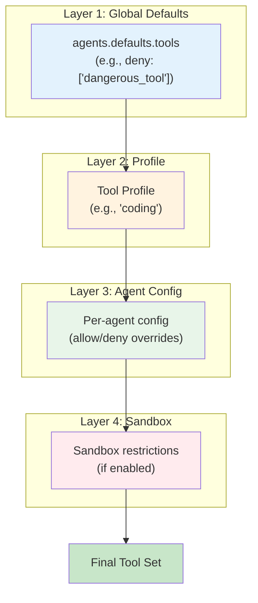
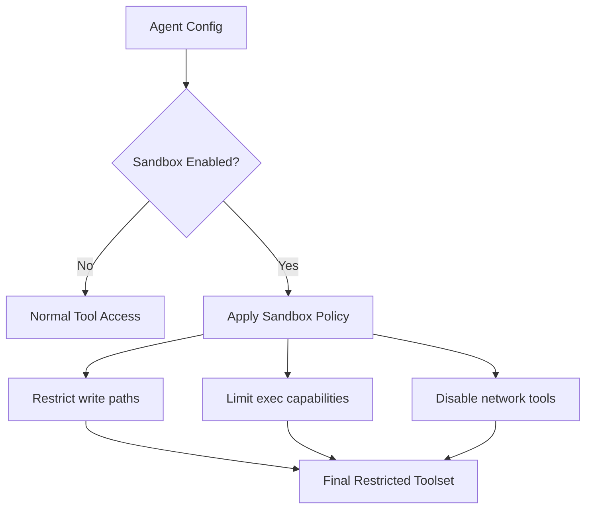

[← Go Back to Main Architecture](../README.md)

# The OpenClaw Tool System

The Tool System defines the capabilities of an agent by providing a set of functions (tools) it can use to interact with the world. It includes a robust policy layer to control tool access, ensuring that subagents and users have only the permissions they need.

---

## Quick Reference

| Concept | Description |
|:--------|:------------|
| **Tool** | A function an agent can call (e.g., `read`, `exec`) |
| **Tool Group** | Logical grouping of related tools |
| **Tool Profile** | Preset collection of tools for common roles |
| **Tool Policy** | Allow/deny rules controlling access |

---

## 1. Tool Groups

Tools are organized into logical groups for easier configuration:

| Group | Description | Included Tools |
|:------|:------------|:---------------|
| `group:fs` | File system operations | `read`, `write`, `edit`, `apply_patch`, `ls`, `find`, `grep` |
| `group:runtime` | Command execution | `exec`, `process` |
| `group:web` | Web interaction | `web_search`, `web_fetch` |
| `group:ui` | User interface | `browser`, `canvas` |
| `group:sessions` | Session management | `sessions_spawn`, `sessions_list`, `sessions_history`, `sessions_send`, `session_status` |
| `group:memory` | Long-term memory | `memory_search`, `memory_get` |
| `group:messaging` | External messaging | `message` |
| `group:automation` | Scheduled tasks | `cron`, `gateway` |
| `group:openclaw` | All native tools | Everything above |

### Using Groups in Configuration

```yaml
tools:
  allow: ["group:fs", "group:web"]  # Allow both groups
  deny: ["exec"]                     # But deny exec specifically
```

---

## 2. Tool Profiles

Profiles provide preset tool collections for common agent roles:

| Profile | Purpose | Included Tools |
|:--------|:--------|:---------------|
| `minimal` | Status only | `session_status` |
| `messaging` | Communication focus | `group:messaging`, basic session tools |
| `coding` | Full dev environment | `group:fs`, `group:runtime`, `group:sessions`, `group:memory`, `image` |
| `full` | Everything | All available tools |

### Profile Selection

```yaml
agents:
  list:
    - id: researcher
      tools:
        profile: messaging  # Use messaging profile
        
    - id: coder
      tools:
        profile: coding    # Use coding profile
```

---

## 3. Layered Policy Resolution

An agent's effective toolset is determined by merging multiple policy layers:



### Resolution Example

```yaml
# Configuration
agents:
  defaults:
    tools:
      deny: ["gateway"]  # Layer 1: Deny gateway globally
      
  list:
    - id: coder
      tools:
        profile: coding   # Layer 2: Coding profile
        allow: ["browser"] # Layer 3: Add browser
        deny: ["exec"]     # Layer 3: Remove exec
      sandbox:
        enabled: true      # Layer 4: Sandbox restrictions
```

**Resolution Steps:**

| Step | Action | Tools Available |
|:-----|:-------|:----------------|
| 1. Global | Apply deny | All except `gateway` |
| 2. Profile | Apply `coding` | `read`, `write`, `edit`, `exec`, `process`, `sessions_*`, `memory_*`, `image` |
| 3. Agent allow | Add `browser` | + `browser` |
| 4. Agent deny | Remove `exec` | - `exec` |
| 5. Sandbox | Auto-restrict | May limit `write` scope |

**Final:** `read`, `write` (limited), `edit`, `process`, `sessions_*`, `memory_*`, `image`, `browser`

---

## 4. Policy Configuration

### Allow List

```yaml
tools:
  allow:
    - "group:fs"      # All file system tools
    - "web_search"    # Just web search
    - "memory_get"    # Just memory get
```

### Deny List

```yaml
tools:
  deny:
    - "exec"          # No command execution
    - "message"       # No external messaging
    - "group:automation"  # No cron/gateway
```

### Combined Example

```yaml
tools:
  allow: ["group:fs", "group:web"]  # Start with these groups
  deny: ["write", "apply_patch"]     # But remove write capabilities
```

Result: `read`, `edit`, `ls`, `find`, `grep`, `web_search`, `web_fetch`

---

## 5. Normalization and Aliases

### Name Normalization

All tool names are normalized to lowercase:

| Input | Normalized |
|:------|:-----------|
| `Web_Search` | `web_search` |
| `EXEC` | `exec` |
| `Read` | `read` |

### Tool Aliases

Aliases improve compatibility between different model conventions:

| Alias | Maps To | Reason |
|:------|:--------|:-------|
| `bash` | `exec` | Some models prefer `bash` |
| `shell` | `exec` | Generic shell command |
| `file_read` | `read` | Alternative naming |
| `file_write` | `write` | Alternative naming |

---

## 6. Sandbox Restrictions

When an agent runs in a sandbox (Docker), additional restrictions apply:



### Common Sandbox Restrictions

| Tool | Restriction |
|:-----|:------------|
| `write` | Limited to sandbox workspace |
| `exec` | May require elevated mode |
| `web_fetch` | May be disabled (no network) |
| `message` | Usually disabled |

---

## 7. Plugin Tools

External plugins can register their own tools:

```typescript
registerPluginTool({
  name: "my_custom_tool",
  group: "group:plugins",
  handler: async (args) => {
    // Tool implementation
  }
});
```

Plugin tools:
- Can be grouped under `group:plugins`
- Follow the same allow/deny policy rules
- Are normalized like native tools

---

## 8. Common Configuration Patterns

### Research Agent

```yaml
- id: researcher
  tools:
    allow: ["group:web", "group:memory"]
    deny: ["group:fs", "group:runtime"]
```

### Secure Coding Agent

```yaml
- id: secure-coder
  tools:
    profile: coding
    deny: ["exec", "message", "gateway"]
  sandbox:
    enabled: true
```

### Read-Only Agent

```yaml
- id: reader
  tools:
    allow: ["read", "ls", "find", "grep", "session_status"]
```

---

## Code Reference

- **Policy Logic**: `src/agents/tool-policy.ts`
- **Group Definitions**: `src/agents/tool-groups.ts`
- **Profile Definitions**: `src/agents/tool-profiles.ts`
