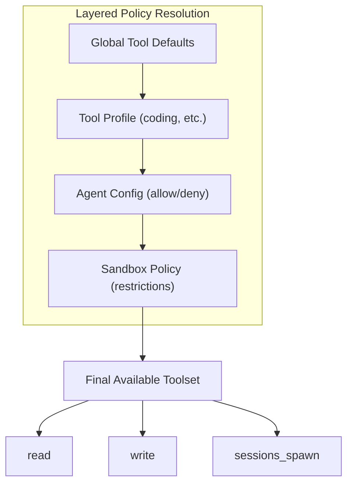

[← Go Back to Main Architecture](../README.md)

# The OpenClaw Tool System

The Tool System defines the capabilities of an agent by providing a set of functions (tools) it can use to interact with the world. It includes a robust policy layer to control tool access, ensuring that subagents and users have only the permissions they need.

## 1. Tool Groups

Tools are organized into logical groups to simplify configuration and permission management.

| Group | Description | Included Tools |
| :--- | :--- | :--- |
| `group:fs` | File system operations | `read`, `write`, `edit`, `apply_patch` |
| `group:runtime` | Command execution | `exec`, `process` |
| `group:web` | Web interaction | `web_search`, `web_fetch` |
| `group:ui` | User Interface | `browser`, `canvas` |
| `group:sessions` | Session management | `sessions_spawn`, `sessions_list`, `sessions_history`, `session_status`, `sessions_send` |
| `group:memory` | Long-term memory | `memory_search`, `memory_get` |
| `group:openclaw`| All native tools | Includes all the above and more |

## 2. Tool Profiles

Profiles provide a base set of tools for common agent roles.

-   **`minimal`**: Only `session_status`. Used for agents that only need to report status.
-   **`messaging`**: Focused on communication. Includes `group:messaging` and basic session tools.
-   **`coding`**: Full environment access. Includes `group:fs`, `group:runtime`, `group:sessions`, `group:memory`, and `image`.
-   **`full`**: Every available tool is allowed.

## 3. Tool Policy Resolution

An agent's effective toolset is determined by merging multiple layers of policy:

1.  **Global Defaults**: Defined in `agents.defaults.tools`.
2.  **Profile Policy**: The base profile assigned to the agent (e.g., `coding`).
3.  **Agent Config**: Specific `allow` and `deny` lists in the agent's entry.
4.  **Sandbox Restrictions**: If an agent is running in a sandbox, the system may automatically strip or restrict high-risk tools like `exec` or `write` depending on the sandbox configuration.

## 4. Normalization and Aliases

The system ensures consistent tool names across different models and configurations:
-   All names are normalized to lowercase.
-   Aliases are supported to improve compatibility between models (e.g., if a model calls for `bash`, the system automatically maps it to the `exec` tool).

## 5. Plugin Support

External plugins can register their own tools. These tools are often grouped under `group:plugins` or can be handled per-plugin. The policy system treats plugin tools identically to native tools, allowing for consistent `allow`/`deny` control.

**Code Reference**: `src/agents/tool-policy.ts` contains the logic for group expansion, profile resolution, and policy merging.
